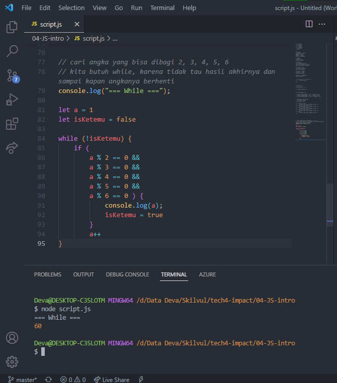

# **Writing & Presentation Test - Week 1**

## Unix Command Line

Dalam tampilan antarmuka kita akan mengenal 2 tampilan, yaitu GUI (Graphic User Interface) dan CLI (Command Line Interface). Pengertian singkatnya, GUI itu bisa melakukan interaksi seperti klik tombol, drag & drop, scroll dan berupa tampilan / gambar. Sedangkan CLI hanya berbasis teks saja.

### Shell

Merupakan perantara yang digunakan antara user dan sebuah sistem operasi pada komputer untuk berkomunikasi atau memerintah sistem.

### CLI (Command Line Interface)
  
CLI adalah tampilan antarmuka berbasis teks yang digunakan untuk berinteraksi dengan perangkat lunak dan sistem operasi untuk melakukan suatu tugas tertentu dengan mengetikkan perintah atau command. 

### Terminal Emulator

Adalah aplikasi atau program komputer yang digunakan untuk mengakses CLI. Dan merupakan tempat dimana shell akan berperan.

### File System Structure

Sebuah struktur untuk mengatur bagaimana data disimpan dalam sebuah sistem. Sistem operasi Windows & Unix menyusun file dan direktori menggunakan struktur yang bentuknya mirip tree seperti contoh dibawah ini :


### Command
  
  Ada beberapa command / perintah dasar yang sering dipakai atau digunakan. Berikut contoh command / perintah berdasarkan fungsinya

  > Command untuk navigasi :
  > - Command **“pwd”** (print working directory), untuk melihat nama directory kita berada saat ini.
  > - Command **“ls”** (lists), untuk melihat isi dari directory.
  > - Command **“cd”** (change directory), untuk pindah ke directory lain.
  
  > Command untuk melihat isi file :
  > - Command **"head"**, untuk melihat beberapa line awal dari sebuah file text.
  > - Command **"tail"**, untuk melihat beberapa line akhir dari sebuah file text.
  > - Command **"cat"**, untuk melihit keseluruhan isi sebuah file.
  
  > Command untuk membuat file & directory :
  > - Command **"touch"**, untuk membuat sebuah file.
  > - Command **"mkdir"**, untuk membuat sebuah directory.
  
  > Command untuk menyalin, memindahkan, dan menghapus files & directory :
  > - Command **“cp”** (copy), untuk menyalin file, **“cp -R”** untuk menyalin directory
  > - Command **“mv”** untuk memindahkan file, **“mv -R”** untuk memindahkan directory. Bisa digunakan juga untuk mengubah nama file atau directory.
  > - Command **“rm”** (remove), untuk menghapus file, **“rm -R”** atau **“rm -d”** untuk menghapus directory


## Git & Github Dasar

### Git
Git adalah tools yang digunakan programmer. Git disini berperan sebagai Version Control System. Version Control System ini bertugas mencatat setiap perubahan pada file (termasuk code yang kita buat) pada suatu proyek baik dikerjakan secara individu maupun tim.

Jadi bisa dibilang, Git adalah aplikasi yang dapat melacak setiap perubahan yang terjadi pada suatu folder atau file. Git biasanya digunakan oleh para programmer sebagai tempat penyimpanan file pemrograman mereka karena lebih efektif dan untuk dokumentasi.

### Github
[GitHub](https://github.com/) adalah sebuah website dan layanan berbasis cloud bagi para developer untuk menyimpan dan mengelola code, serta mendokumentasikan dan mengontrol perubahannya. Selain Github, ada aplikasi lain yang bisa digunakan untuk menyimpan dan mengelola kode, serta mendokumentasikan dan mengontrol perubahannya yaitu [Gitlab](https://about.gitlab.com/) dan [BitBucket](https://lasp.colorado.edu/nucleus/login)

### Mengapa harus menggunakan Git & Github?
Dengan menggunakan GIT dan Github, kamu akan bisa bekerja dalam sebuat tim. Tujuan besarnya adalah kamu bisa berkolaborasi mengerjakan proyek yang sama tanpa harus repot copy paste folder aplikasi yang terupdate.

Kamu juga tidak perlu menunggu rekan dalam satu tim kamu menyelesaikan suatu program dahulu untuk berkolaborasi. Kamu bisa membuat file didalam projek yang sama atau membuat code di file yang sama dan menyatukannya saat sudah selesai.

### Instalasi Git
Untuk cara instalasi git sendiri sebenarnya bisa dilihat di internet karena sudah banyak yang memberikan tutorial tersebut. Atau untuk memudahkan bisa dilihat pada link berikut. [Instalasi Git](https://pendragon.netlify.app/git-installation#instalasi-git-pada-windows)

### Git Repository
Repository atau repo adalah direktory penyimpanan file proyek. Di sini, kita bisa menyimpan apa pun yang berkaitan dengan proyek yang sedang kita buat, misalnya file kode, gambar, atau audio. Repo sendiri bertempat di penyimpanan atau storage GitHub atau repositori lokal di komputer kita.

### GIT Command

- #### git config
Digunakan untuk mengatur konfigurasi tertentu sesuai keinginan pengguna, seperti email, algoritma untuk diff, username, format file, dll. Dan perintah ini cukup dijalankan sekali saja. 
Contohnya, perintah berikut bisa digunakan untuk mengatur email :
> git config --global user.email johnDoe@google.com

- #### git init
Command line dibawah akan membuat sebuah repository dan directory baru.
> git init "nama-project"

Namun, jika folder sudah ada sebelumnya. Maka kita bisa menggunakan command line berikut :
> git init .

- #### git status
Perintah ini akan menampilkan daftar file yang berubah bersama dengan file yang ingin di tambahkan atau di-commit
> git status

3 kondisi file pada git


Modified adalah kondisi dimana revisi atau perubahan sudah dilakukan, tetapi belum ditandai (untracked) dan belum disimpan dalam version control.

Staged adalah kondisi dimana revisi sudah ditandai (modified) namun belum disimpan di version control.

Commit/committed adalah kondisi dimana revisi sudah disimpan pada version control.

- #### git add
Perintah git add digunakan untuk menambahkan file baru / file yang telah diubah sebelum do commit
> git add file.txt

> git add .

- #### git commit
Perintah git commit digunakan untuk melakukan commit (save) perubahan pada version control
> git commit –m “commit-message”

- #### git branch
Perintah git branch bisa digunakan untuk me-list, membuat atau menghapus branch. Untuk menampilkan semua branch yang ada di repository, gunakan:
> git branch

Untuk menghapus branch:
> git branch -d "nama-branch"

- #### git checkout
Perintah git checkout bisa digunakan untuk membuat branch atau untuk berpindah diantaranya. Misalnya, perintah berikut ini akan membuat branch baru dan berpindah ke dalamnya:
> git checkout -b "nama-branch"

Untuk berpindah dari branch satu ke lainnya, gunakan:
> git checkout "nama-branch"

- #### git remote
Perintah git remote akan membuat user terhubung ke remote repository. Perintah berikut ini akan menampilkan repository yang sedang dikonfigurasi:
> git remote -v

Perintah ini membuat user bisa menghubungkan repository lokal ke remote server:
> git remote add "alamat repository"

- #### git push
Perintah git push akan mengirimkan perubahan ke master branch dari remote repository yang berhubungan dengan directory local. Misalnya:
> git push origin master

- #### git pull
Untuk menggabungkan semua perubahan yang ada di remote repository ke directory local, gunakan perintah pull:
> git pull

- #### git merge
Perintah merge digunakan untuk menggabungkan sebuah branch ke branch aktif. Gunakan:
> git merge "nama-branch"

- #### git clone
Perintah ini digunakan jika kita ingin menduplikasi atau mendapatkan sebuah repository yang sudah ada ke dalam directory kita yang sudah terhubung dengan git.
> git clone https://github.com/libgit2/libgit2

Namun jika ingin menyimpannya ke directory lain, bisa gunakan:
> git clone https://github.com/libgit2/libgit2 mylibgit


## HTML

### Definisi
HTML adalah singkatan dari Hyper Text Markup Language. HTML adalah bahasa komputer yang digunakan untuk membuat kerangka atau struktur untuk web pages (halaman website) di internet. 

### Fungsi dan Cara kerja HTML 
Fungsi HTML adalah sebagai 'kerangka' dari sebuah website.

Web browser seperti Chrome, Firefox, Edge, Safari, atau Opera akan membaca dokumen HTML. Dokumen HTML yang berisi tag-tag HTML akan memberitahu browser bagaimana cara menampilkan sebuah konten.

### Tools Pendukung
Ada 2 tools utama yang harus dipersiapkan untuk membuat HTML, yaitu:

- Browser
- Code Editor

Browser yang direkomendasikan untuk pembuatan HTML ini adalah [Chrome](https://www.google.com/intl/id_id/chrome/). Sedangkan untuk code editor yang direkomendasikan adalah [Visual Studio Code](https://code.visualstudio.com/).

### Tag HTML
HTML terdiri dari komponen yang disebut HTML Tag. Tag adalah sebauh penanda awalan dan akhiran dari sebuah elemen di HTML. Tag dibuat dengan kurung siku (<...>), lalu di dalamnya berisi nama tag dan kadang juga ditambahkan dengan atribut.

Pada umumnya, ada 2 tipe HTML Tag:
1. **Opening Tag** (tag pembuka) - contohnya adalah `<p>`.
2. **Closing Tag** (tag penutup) - contohnya adalah `</p>`.

### Struktur Dokumen HTML
Dokumen HTML memiliki 3 tag utama, yaitu tag `<html>`, `<head>`, dan `<body>`. 

```
<!DOCTYPE html>
<html>
  <head>
    <title>Latihan</title>
  </head>
  <body>
    <h1>Hello World!</h1>
  </body>
</html>
```

- `<!DOCTYPE>` syntax mendefinisikan versi dari HTML yang digunakan dan harus dideklarasi sebelum tag `<html>`. `<!DOCTYPE html>` mendefinisikan bahwa dokumen ini adalah HTML5.
- `<html></html>` adalah root element dari halaman HTML. Semua HTML tag lainnya harus dibungkus dengan tag ini.
- `<head>` pada umumnya berisi `<meta>`, `<title>`, konten css/js internal maupun link ke file css/js eksternal.
- `<body>` berisi konten website yang ingin ditampilkan pada browser.

### HTML Element
HTML Element merupakan sebuah komponen dalam halaman web, bisa berupa paragraf, judul, atau gambar.

Struktur dari sebuah HTML element dapat digambarkan seperti ini:


Pada umumnya, HTML Element terdiri dari:
- **Opening Tag** (tag pembuka) - contohnya adalah `<p>`.
- **Closing Tag** (tag penutup) - contohnya adalah `</p>`.
- **Attribute** - contohnya adalah style yang memiliki Value "color=red". HTML Attribute akan kita pelajari di topik selanjutnya.
- **Content** (konten) yang ingin ditampilkan di browser - contohnya adalah My first paragraph.

Ada dua jenis HTML Element, yaitu:
1. **HTML Element** yang memiliki **Opening Tag** (tag pembuka) dan **Closing Tag** (tag penutup) - contohnya adalah `<p>` dan `</p>`.
2. **Empty HTML Element**, memiliki **Self-closing Tag**, yang hanya memiliki **Opening Tag** (tag pembuka) dengan garis miring sebelum kurung tutup - contohnya adalah `<br />` atau ``.


### Tag HTML yang sering digunakan

- #### Tag Heading
Tag heading hanya memiliki 6 tingkatan. Penulisannya seperti di bawah ini:

```
<h1>Heading Satu</h1>
<h2>Heading Dua</h2>
<h3>Heading Tiga</h3>
<h4>Heading Empat</h4>
<h5>Heading Lima</h5>
<h6>Heading Enam</h6>
```

Hasilnya di browser akan seperti ini:


- #### Tag Paragraf
Untuk membuat paragraf pada halaman website, maka dibutuhkan tag `<p>`. Penulisannya seperti ini:

```
<p>
  Lorem ipsum dolor sit, amet consectetur adipisicing elit. Voluptate tempora
  provident quaerat officia maxime totam, repudiandae libero ducimus hic esse
  ipsam quam cum voluptates enim laudantium fugit quis eum suscipit.
</p>
```

Hasilnya di browser akan seperti ini:


- #### Tag Link/Anchor
Untuk membuat link pada halaman web agar bisa mengakses halaman web lain, maka diperlukan tag `<a>`. Tag `<a>` memiliki attribute href yang berguna untuk menyimpan link website yang dituju.

Penggunannya seperti ini:

```
<a href="https://youtube.com"> Youtube </a>
```

Hasilnya di browser akan seperti ini:


Dan jika kata youtube itu di klik, maka akan langsung membuka halaman website Youtube.

- #### Tag Huruf Tebal
Tag `<b>` atau `<strong>` digunakan untuk membuat tulisan menjadi tebal. Contoh penggunaannya:

```
<p>
  Nama saya <b>Sarah</b>. Saya berumur <strong>22 tahun.</strong>
</p>
```

Contoh di atas akan terlihat di browser seperti ini:


- #### Tag Huruf Miring
Untuk membuat huruf bercetak miring, maka dibutuhkan tag `<i>` atau `<em>`. Contoh penggunaan:

```
<p>
  Nama latin dari tanaman padi adalah <i>Oryza</i> <em>sativa L.</em>
</p>
```

Contoh di atas akan terlihat di browser seperti ini:


- #### Tag List
Ada dua tipe list di HTML, yaitu:

1. Unordered list dengan menggunakan tag `<ul>`
2. Ordered list dengan menggunakan tag `<ol>`

Masing-masing list baik `<ul>` atau `<ol>` memiliki element `<li>` untuk mendefinisikan nilai-nilai dari list tersebut. Contoh:

```
<!-- Unordered List -->
<ul>
  <li>Kopi</li>
  <li>Teh/li>
  <li>Susu</li>
</ul>

<!-- Ordered List -->
<ol>
  <li>Kucing</li>
  <li>Anjing</li>
  <li>Ikan</li>
</ol>
```

Contoh di atas akan terlihat di browser seperti ini:


- #### Tag Gambar
Untuk menampilkan gambar pada halaman sebuah website, maka kita membutuhkan tag ``. Contoh penggunaannya:

```

```

Hasil dari kode di atas pada browser akan terlihat seperti ini:


- #### Tag Tabel
Pada dasarnya, untuk membuat sebuah tabel di HTML cukup membutuhkan tiga tag, yaitu:
1. `<table>` sebagai element utama.
2. `<tr>` atau dikenal sebagai table row tag, digunakan untuk membuat baris baru di dalam `<table>`.
3. `<td>` atau dikenal sebagai table data tag, digunakan sebagai container (wadah) dari data yang kita mau isi di dalam `<tr>`.

Kita juga bisa menggunakan tag `<th>` sebagai pengganti `<td>` untuk membuat header cell (biasanya digunakan untuk menampilkan judul kolom).

Secara standar `<th>` membuat tulisan di dalamnya menjadi tebal.

Cara penggunaannya seperti ini:

```
<table>
  <tr>
    <th>Nama</th>
    <th>Nomor Telpon</th>
    <th>Negara</th>
  </tr>
  <tr>
    <td>Sarah</td>
    <td>0811111111</td>
    <td>Indonesia</td>
  </tr>
  <tr>
    <td>Sophia</td>
    <td>0822222222</td>
    <td>Indonesia</td>
  </tr>
</table>
```

Pada browser, kode di atas akan terlihat seperti ini:


### Deploy Project
Deploy adalah sebuah proses untuk menyebarkan atau mempublikasikan aplikasi yang sudah kita kerjakan supaya bisa digunakan oleh orang-orang. Jika aplikasi kita HTML atau Web App kita perlu mendeploy ke server. Untuk melakukan hal tersebut kita bisa menggunakan layanan yang bernama Netlify.


## CSS

### Definisi
CSS adalah singkatan dari Cascading Style Sheets. CSS adalah bahasa komputer yang digunakan untuk menambahkan design ke suatu halaman website di internet.

### Fungsi dan Cara kerja CSS
Fungsi CSS adalah sebagai 'baju' atau 'dekorator' dari sebuah website.

Apabila di dokumen HTML terdapat konten CSS maka browser akan memproses CSS tersebut dan menampilkan design sesuai dengan apa yang telah ditentukan.

### Cara menyisipkan CSS

Ada 3 cara untuk menyisipkan CSS ke dalam HTML, yaitu:
1. Inline CSS, yaitu menggunakan attribute style untuk menyisipkan kode CSS langsung di dalam HTML element.
2. Internal CSS, yaitu menggunakan element `<style>` untuk menyisipkan kode CSS. Element `<style>` tersebut diletakkan di dalam element .
3. External CSS, yaitu sebuah file CSS terpisah yang disambungkan dengan file HTML dengan menggunakan element `<link>`.

- #### Inline CSS
Inline CSS adalah cara kita memberikan attribute style kepada sebuah element dengan menyisipkannya langsung di dalam element HTML tersebut. Contoh:

```
<!DOCTYPE html>
<html>
  <head>
    <title>
      Website Pertamaku
    </title>
  </head>
  <body>
    <h1 style="color:blue;">Selamat Datang</h1>
  </body>
</html>
```

Contoh di atas akan menghasilkan teks Selamat Datang di dalam element `<h1>` berwarna biru.


- #### Internal CSS
Internal CSS menggunakan element `<style>` untuk menyisipkan kode CSS. Element `<style>` diletakkan di dalam element `<head>`. Contoh:

```
<!DOCTYPE html>
<html>
  <head>
    <title>Website Pertamaku</title>
    <style>
      body {
        background-color: yellow;
      }
      h1 {
        color: blue;
      }
      p {
        color: red;
      }
    </style>
  </head>
  <body>
    <h1>Website Pertamaku</h1>
    <p>Selamat Datang</p>
  </body>
</html>
```

Contoh di atas akan menghasilkan `<body>` dengan latar belakang berwarna kuning, tulisan di dalam `<h1>` berwarna biru, dan tulisan di dalam `<p>` berwarna merah.


- #### External CSS
External CSS adalah cara menyisipkan kode CSS dengan cara membuat file CSS terpisah, dan lalu menyambungkannya dengan file HTML dengan menggunakan element `<link>`. Element `<link>` tersebut diletakkan di dalam element `<head>`. 

Contoh:
Kita memiliki dua file: index.html untuk file HTML-nya dan styles.css untuk file CSS-nya.

```
<!-- File index.html -->
<!DOCTYPE html>
<html>
  <head>
    <title>Website Pertamaku</title>
    <link rel="stylesheet" href="styles.css" />
  </head>
  <body>
    <h1>Website Pertamaku</h1>
    <p>Selamat Datang</p>
  </body>
</html>
```
```
/* File styles.css */
body {
  background-color: pink;
}
h1 {
  color: blue;
}
p {
  color: black;
}
```

Contoh di atas akan menghasilkan warna `<body> `background bewarna pink, tulisan di dalam `<h1>` berwarna biru, dan tulisan di dalam `<p>` berwarna hitam.


Kelebihan lain dari menyisipkan kode CSS dengan cara external CSS adalah kita bisa menyisipkan beberapa external CSS file di halaman website kita.

Contoh:
Misalnya kita mempunyai 2 CSS file style1.css dan style2.css dan kita ingin menyisipkan kedua file ini ke dalam index.html.

### CSS Syntax
CSS Syntax adalah syntax yang digunakan untuk menunjuk atau memilih HTML element mana yang ingin diberi style (dihias). CSS syntax terdiri dari selector, property, dan value. 

Syntaxnya seperti ini:

```
selector {
  property: value;
}
```

Bisa kita gambarkan seperti vas bunga yang ingin kita hias. Kita ingin mencat vas bunga tersebut menjadi berwana merah. Yang kita cat adalah bagian tubuh (body) dari vas bunga tersebut. Jika kita kaitkan dengan CSS selector, maka:
- **Selector** adalah vas bunga, yaitu benda (HTML element, misal paragraf) mana yang akan dihias.
- **Property** adalah bagian mana dari vas bunga (dalam HTML misal, setiap huruf dari paragraf) yang akan dihias, dalam kasus ini berarti warna dari vas tersebut.
- **Value** adalah warna merah, yaitu nilai atau hiasan 'berupa apa' yang akan diberikan ke vas bunga.

### Box Model
Pada dasarnya, semua HTML element itu dianggap sebagai sebuah kotak (box). Karena hal inilah istilah box model muncul.

Box model sendiri bisa kalian anggap sebagai kotak yang membungkus setiap HTML element.

Box model terdiri dari:
- **margin** yaitu area terluar yang kosong setelah border. Margin bersifat transparan.
- **border** yaitu garis tepi yang membungkus padding dan konten.
- **padding** yaitu area kosong di antara konten dan border. Padding bersifat transparan.
- **content** yaitu konten (value/nilai) dari HTML element. Bisa berupa teks, gambar, video, ataupun suara.

Jika digambarkan, box model berbentuk seperti ini:


### CSS Display
Properti Display adalah properti CSS yang paling penting untuk mengontrol tata letak. Properti Display menentukan jika/bagaimana suatu elemen ditampilkan.

Setiap elemen HTML memiliki nilai display default tergantung pada jenis elemennya. Nilai display default untuk sebagian besar elemen adalah block atau inline

Dengan properti display, kita bisa mengatur bagaimana box tersebut ditampilkan: apa box tersebut ditampilkan sebaris dengan box lain? atau satu box menempati satu baris penuh? bahkan kita juga bisa mengatur apakah box tersebut ditampilkan atau disembunyikan.

### CSS Position
Properti position menentukan jenis metode penentuan posisi yang digunakan untuk suatu element.

Ada lima nilai position yang berbeda:
1. static
2. relative
3. fixed
4. absolute
5. sticky

Element kemudian diposisikan menggunakan properti atas, bawah, kiri, dan kanan. Namun, properti ini tidak akan berfungsi kecuali properti posisi disetel terlebih dahulu. Mereka juga bekerja secara berbeda tergantung pada nilai posisi.

### Desain Website Responsif

- #### Viewport 
Secara umum viewport adalah daerah pada layar yang menampilkan suatu konten. Dalam konteks kita kali ini, tentu viewport adalah daerah yang menampilkan halaman web yang sedang kita akses.

Perlu kalian ingat bahwa ukuran viewport tidak selalu sama dengan resolusi layar perangkat.

Coba kalian cermati tangkapan layar berikut.


Gambar di kiri merupakan tangkapan layar pada komputer; gambar di kanan pada smartphone.

Kotak berwarna hijau mewakili keseluruhan layar perangkat. Namun area yang kita sebut viewport tadi itu digambarkan oleh kotak berwarna biru.

Kembali ke permasalahan di awal: Bagaimana kita membuat halaman web kita menjadi responsif? Bagaimana kita memastikan halaman web yang kita buat nanti itu tidak terlihat buruk atau terlalu besar pada perangkat mobile?

Untuk membuat halaman website menjadi responsif, maka kita perlu menambahkan meta data berikut ini di dalam element `<head>` di file HTML.

``` 
<meta name="viewport" content="width=device-width, initial-scale=1.0" />
```

Meta data di atas akan mengatur viewport dari halaman website, di mana meta data tersebut akan memberikan instruksi kepada browser untuk mengatur bagaimana dimensi dan skala dari halaman website kita.
1. **width=device-width** memberitahu browser untuk mengikuti lebar layar dari perangkatnya. Sebab lebar layar tiap perangkat berbeda-beda.
2. **initial-scale=1.0** memberitahu browser tingkat pembesaran (zoom level) dari halaman itu.


- #### Media Query 
Media query merupakan modul CSS3 yang berguna membuat layout kita responsive dengan menyesuaikan tampilan berdasarkan ukuran layar perangkat. 

Terkadang tampilan yang sudah kita desain dengan sedemikian rupa bisa kacau jika ditampilkan pada tampilan mobile. Dengan media query kita dapat menyelesaikan masalah ini dengan menentukan aturan ukuran dan tata letak elemen dengan kondisi-kondisi tertentu

Media query juga disebut dengan Breakpoint, karena cara kerja media query yakni dengan cara mengecheck ukuran viewport(layar/area dimana konten terlihat) apakah sesuai dengan kondisi yang kita deklarasikan, jika benar maka kode dalam kondisi tersebut yang akan dieksekusi. Dengan kata lain media query memberikan kemampuan menggunakan kode css yang sesuai dengan kondisi yang ditentukan.

- #### Flex Box

Ada dua istilah penting saat belajar flexbox:

1. **container** adalah element yang membungkus dan mengatur tampilan dari element di dalamnya,
2. **item** adalah element dalam container yang diatur tampilannya.

Salah satu properti yang sering digunakan dalam implementasi flexbox adalah **justify-content** yang digunakan untuk mengatur tata letak dan ruang di antara item tersebut. Perhatikan kode berikut:

```
<!DOCTYPE html>
<html>

<head>
	<style>
        html, body, #flex-container {
            height: 100%;
        }
		#flex-container {
			display: flex;
			flex-direction:row;
			justify-content: flex-start;
		}
		.flex-item {
			width: 100px;
			height: 100px;
			margin: 4px;
			background: #ec5453;
			font-size: 60px;
			color: white;
			text-align: center;
		}
	</style>
</head>

<body>
	<div id="flex-container">
		<div class="flex-item">1</div>
		<div class="flex-item">2</div>
		<div class="flex-item">3</div>
	</div>
</body>

</html>
```

Ini akan menghasilkan tiga buah persegi berukuran 100px seperti ini:


Properti justify-content bisa diisi dengan satu dari beberapa nilai berikut:

- **flex-start** - semua item akan ditempatkan di depan seperti pada gambar di atas.
- flex-end - semua item akan ditempatkan di belakang seperti ini:
  


- **center** akan memampatkan semua item ke tengah:


- **space-between** akan memberi ruang pada setiap dua item yang bersebelahan:


- **space-around** akan memberi ruang pada sekitar tiap item:


## Algoritma & Data Structures

### Definisi

- #### Algoritma
Algoritma adalah deskripsi berupa langkah-langkah yang dibutuhkan untuk menyelesaikan suatu masalah.

Pengertian lain menjelaskan bahwa algoritma adalah urutan langkah logis tertentu untuk memecahkan suatu masalah. 

Manfaat dilakukannya algoritma adalah untuk memungkinkan seorang developer untuk berpikir kritis dalam menyelesaikan suatu masalah agar solusi yang didapat lebih efektif.


- #### Data Structure
Struktur Data adalah cara mengumpulkan dan mengatur data sedemikian rupa sehingga kita dapat melakukan operasi pada sebuah data dengan cara yang efektif. 

Struktur Data adalah tentang merender elemen data dalam beberapa hubungan, untuk organisasi dan penyimpanan yang lebih baik.

Struktur Data digunakan untuk mengelola/manajemen sebuah data.

Struktur Data dapat meningkatkan kualitas algoritma.


### Perbedaan
Algoritma memberikan langkah-langkah yang dilakukan untuk menyelesaikan masalah, sedangkan struktur data mengatur data yang dibutuhkan dalam memori (mengorganisasi data). 

### Seberapa Penting Algoritma ?
Programming itu justru identik dengan memecahkan suatu permasalahan, maka dari itu algoritma merupakan pemeran utamanya.

Bahasa pemrograman hanyalah pemeran pendamping. Belajar algoritma sama aja dengan mengingat kembali alur berfikir yg terstruktur.

### Penulisan atau Penyajian Algoritma
Algoritma dapat ditulis dalam 3 bentuk, yaitu:

> 1. Deskriptif, penulisan algoritma dengan cara deskriptif seperti kita menulis tutorial (tata cara) dengan bahasa sehari-hari.
>
> 2. Flow Chart atau diagram alir, penyajian algoritmanya lebih mudah dibaca karena memiliki tampilan visual. Flow chart menggunakan simbol bangun datar sebagai representasi dari proses yg dilakukan.
>
> 3. Pseudo Code, penulisan algoritmanya hampir menyerupai penulisan pada kode pemrograman.

> Note : Pseudo Code bukanlah sebuah bahasa pemrograman.

### Contoh Algoritma Sederhana
Algoritma Menampilkan deret angka 1 sampai 10
```
Deskriptif
1. siapkan i bernilai 1
2. Apakah i <= 10?
3. Jika ya, ke no 5
4. Jika tidak, ke no 8
5. tampilkan i
6. lalu i jumlahkan dengan 1
7. dan kembali ke no 2
8. proses selesai
```


```
Pseudo Code
Menampilkan deret angka 1 - 10
deklarasi
          i ← 1
deskripsi
          while i <= 10
                        print i
                        i = i + 1
          end
```

### Penerapan Algoritma dengan Javascript
Kita ambil contoh kasus algoritma sebelumnya, yaitu Menampilkan deret angka 1- 10. Berikut penerapan dan hasilnya:


> Note : Disini saya menggunakan looping for untuk penerapannya.


## Javascript Intro

### Definisi
Javascript adalah bahasa pemrograman yang ringan, dinamis, dan dapat dikoordinasikan untuk oriented programming maupun functional programming. 

Javascript biasanya digunakan untuk melakukan perubahan pada tampilan website, misalnya saat mengklik tombol, menentukan desain dan layout, memberikan efek yang unik atau animasi yang lucu dan menarik. 

Fungsi JavaScript, sebagai element yang membuat website menjadi interaktif.

### Cara Menyisipkan Javascript
Ada dua cara, yaitu:

1. **Internal JavaScript**, yaitu menyisipkan kode JavaScript langsung di dalam file HTML.
2. **External JavaScript**, yaitu membuat file JavaScript sendiri dan menyambungkannya dengan file HTML.

- #### Internal Javascript
Untuk menyisipkan kode JavaScript di dalam file HTML, kita bisa menuliskan kode JavaScript di dalam tag `<script>`. Tag `<script>` sendiri bisa ditulis di dalam `<head>` maupun di dalam bagian akhir dari `<body>`.

Contoh:
```
<!-- <script> tag di dalam <head> -->

<!DOCTYPE html>
<html>
  <head>
    <title>Website Pertamaku</title>
    <script>
      console.log("Halo Semua!"); // output : Halo Semua!
    </script>
  </head>
  <body>
    <h2>JavaScript di dalam head</h2>
  </body>
</html>
```
```
<!-- <script> tag di dalam <body> -->

<!DOCTYPE html>
<html>
  <head>
    <title>Website Pertamaku</title>
  </head>
  <body>
    <h2>JavaScript di dalam body</h2>

    <script>
      console.log("Halo Semua!"); // output : Halo Semua!
    </script>
  </body>
</html>
```

- #### Eksternal Javascript
Cara menyambungkannya sama seperti internal JavaScript, yaitu menggunakan tag `<script>` di dalam element `<body>`, hanya saja, kita menambahkan attribute src di dalam `<script>` untuk menyambungkan dengan file eksternal JavaScript kita.

Contoh:
```
<!-- File index.html -->

<!DOCTYPE html>
<html>
  <head>
    <title>Website Pertamaku</title>
    <script src="script.js"></script>
  </head>
  <body>
    <h2>Hello, World!</h2>
  </body>
</html>
```
```
// File script.js

console.log("Halo Semua!"); // output : Halo Semua!
```

### Mendeklarasikan Variabel
Cara mendeklarasikan sebuah variabel adalah dengan kata kunci var, let atau const dan diikuti dengan nama variabelnya, seperti ini:

- var namaVariabel1 = "hallo";

- let namaVariabel2 = "hello";

- const namaVariabel3 = "world";

> Note : untuk penulisan dengan var sudah jarang digunakan dan tidak disarankan

Dalam menamakan variabel, perlu mengikuti beberapa ketentuan sebagai berikut:
1. Menggunakan konvensicamelCase, yaitu menggunakan huruf kecil pada permulaan kata, dan jika nama variabel terdiri dari 2 kata atau lebih, maka kata kedua dan berikutnya diawali dengan huruf besar.
2. Nama variabel boleh diawali dengan underscore(_), huruf besar (jika diharuskan), dan $.
3. Nama variabel tidak diawali dengan angka, @, *, #, !, %, (), -, +.
4. Tidak boleh menggunakan kata kunci JavaScript seperti boolean, break, else, extends, dan lain-lain.
5. Antara kata pertama dan kata kedua tidak diberi spasi atau dash(-);
6. Karena JavaScript bersifat case-sensitive, maka penamaan juga case-sensitive (jadi variabel hitung dengan variabel Hitung itu berbeda).

### Tipe Data Javascript
Berikut beberapa tipe data dalam Javascript

- String, deretan karakter yang diapit oleh sepasang tanda kutip.
```
 let nama = "Deva"
```
> Note : bisa menggunakan tanda (' '), (" "), (``)

- Number, bilangan bulat, pecahan, dan lain-lain.
``` 
let number = 13
```
> Note: Dalam tipe data number ini dibagi lagi :
> - integer (seperti 1, 2, dan 3)
> - atau float (seperti 3.14, 2.718, dan 1.618)

- Boolean, nilai benar dari sebuah pernyataan yang dituliskan sebagai true atau false.
```
let x = true
let y = false
```

- Null, sebuah nilai yang berarti kosong atau menunjuk pada nilai yang tidak ada.
```
let z = null
```

- Undifined, berbeda dari null, undefined menandakan kondisi variabel yang belum diberi sebuah nilai. Jadi pernyataan "nilai variabel itu adalah undefined" sebenarnya kurang tepat, sebab variabelnya memang tidak mempunyai sebuah nilai.
```
let z
console.log(z);
```
> Note : Kode diaatas akan menampilkan undefined karena variabel belum diberi sebuah nilai.

- Object, sebuah kumpulan pasangan properti dan nilai
```
let mahasiswa = {
  nama: "Deva"
  nim: 1234567
}
```

- Array, adalah tipe variabel yang dapat menampung berbagai jenis data dengan tipe yang bermacam-macam, dengan jumlah yang tidak terbatas.
```
let buah = ['mangga', 'pisang', 'durian']
```

### Operator Javascript
Terdapat beberapa jenis operator dalam Javascript, yaitu:

- #### Operator Aritmatika
Operator aritmatika digunakan di operasi matematika yang melibatkan data dengan tipe number.

Operator-operator tersebut dapat dilihat pada tabel berikut ini:
```
+	=   Penjumlahan
-	=   Pengurangan
*	=   Perkalian
/	=   Pembagian
**	=   Eksponen (pangkat)
%	=   Modulus (menghasilkan sisa hasil pembagian)
++	=   Increment (menambah 1)
--	=   Decrement (mengurangi 1)
```

Contoh penggunaan :
```
let a = 5
let b = 10
let hasil = a * b

console.log(hasil); // output 50
```


- #### Operator Assignment
Assignment operator digunakan untuk memberikan nilai pada variabel.
```
Assignment    Operator    Contoh Penggunaan   Setara Dengan
=	            	            x=y	            x=y
=	            +	            x += y	        x = x + y
=	            -	            x -= y	        x = x - y
=	            *	            x *= y	        x = x * y
=	            /	            x /= y	        x = x / y
=	            %	            x %= y	        x = x % y
=	            **	            x **= y	        x = x ** y
```

- #### Operator Perbandingan
Operator perbandingan digunakan untuk membandingkan dua data atau nilai.
```
Operator	            Deskripsi
==	            sama dengan (cek nilai)
===	            sama dengan (cek nilai dan tipe data)
!=	            tidak sama dengan (cek nilai)
!==	            tidak sama dengan (cek nilai dan tipe data)
>	            lebih dari
<	            kurang dari
>=	            lebih dari atau sama dengan
<=	            kurang dari atau sama dengan
? :	            ternary operator
```

Contoh penggunaan :
```
let bilangan = 10;

console.log(bilangan == 10); // Output: true
console.log(bilangan == 8); // Output: false
console.log(bilangan == "10"); // Output: true
```


- #### Operator Logika
Operator logika digunakan untuk menentukan logika antara dua kondisi atau nilai.
```
Operator        Deskripsi
&&	            AND (Dan)
||	            OR (Atau)
!	            NOT (Bukan)
```
Tabel perbandingan:
```
Operator	  Kondisi 1	      Kondisi 2	        Hasil
&&	            true	        true	        true
&&	            true	        false	        false
&&	            false	        true	        false
&&	            false	        alse	        false
||	            true	        true	        true
||	            true	        false	        true
||	            false	        true	        true
||	            false	        false	        false
!	            true	        -	            false
!	            false	        -	            true
```

### Javasxript Control Flow
- #### Conditional
  - Conditional merupakan statement percabangan yang menggambarkan suatu kondisi.
  - Conditional statement akan mengecek kondisi spesifik dan menjalankan perintah berdasarkan kondisi tersebut
  - Perintah akan dijalankan jika hanya kondisi bernilai true.

- #### Looping
  - Looping adalah control flow yang mengulang sebuah instruksi/perintah hingga kondisinya terpenuhi atau jika kondisi stop/berhenti tercapai.
  - Looping biasanya digunakan untuk mempersingkat penulisan kode sehingga menghemat waktu.

Berdasarkan penjelasan diatas cukup terlihat perbedaan antara conditional dan looping. Berikut ini terdapat beberapa conditional dan looping yang ada pada Javascript

### Conditional
- #### if
Digunakan apabila hanya ada 1 kondisi dan 1 keputusan yang dijalankan.
```
if (kondisi1) {
  // masukkan kode yang akan dijalankan di sini apabila kondisi1 tercapai
}
```

- #### if ... else
Digunakan apabila ada 1 kondisi dan 2 keputusan yang dijalankan.
```
if (kondisi1) {
  // masukkan kode yang akan dijalankan di sini apabila kondisi1 tercapai
} else {
  // masukkan kode yang akan dijalankan di sini apabila kondisi1 TIDAK tercapai
}
```

- #### if ... else if ...
Digunakan apabila ada beberapa kondisi dan beberapa keputusan yang dijalankan.  
```
if (kondisi1) {
  // masukkan kode yang akan dijalankan di sini apabila kondisi1 tercapai
} else if (kondisi2) {
  // masukkan kode yang akan dijalankan di sini apabila kondisi1 tidak tercapai dan kondisi2 tercapai
} else if (kondisi3) {
  // masukkan kode yang akan dijalankan di sini apabila kondisi1 dan kondisi2 tidak tercapai, dan kondisi3 tercapai
} else {
  // masukkan kode yang akan dijalankan di sini apabila semua kondisi di atas TIDAK tercapai
}
```

- #### switch case
Jika kita memiliki banyak pilihan kondisi, menggunakan perintah if, else if dan else akan kurang efisien karena kode yang ditulis akan menjadi sangat panjang sekali.

Alternatifnya adalah menggunakan switch dan case
```
switch (pernyataan) {
  case kondisi1:
    // keputusan yang dijalankan ketika kondisi1 tercapai
    break;
  case kondisi2:
    // keputusan yang dijalankan ketika kondisi2 tercapai
    break;
  case kondisi3:
    // keputusan yang dijalankan ketika kondisi3 tercapai
    break;
  ...
  default:
    // keputusan yang dijalankan ketika semua kondisi tidak tercapai
}
```
- 
  -  switch digunakan untuk mendeklarasikan pernyataan yang menjadi patokan kondisi.
  - case digunakan untuk menulis masing-masing kondisi dari hasil pernyataan yang akan diperiksa.
  - break digunakan untuk menghentikan program berjalan ketika sudah menemukan kondisi yang tercapai.
  - default adalah keputusan yang akan dijalankan apabila hasil pernyataan di switch tidak ada yang sesuai dengan masing-masing kondisi di case (tidak ada kondisi yang tercapai).


### Loopping

- #### for loop
For loop merupakan instruksi pengulangan yang dapat kita berikan pada program yang kita kembangkan.

Gunakan for loop jika kita tahu seberapa banyak nilai pasti untuk pengulangannya

```
for (initialization; condition; post-expression) {
  // statement
}
```
> - Inisialisasi: Sebagai inisialisasi awal dari mana mulainya sebuah pengulangan. Kita memberikan nilai awal/default pada parameter ini.
> - Condition: For loop akan terus berjalan selama kondisi ini terpenuhi. Selama kondisi bernilai TRUE.
> - Post-expression (Increment/Decrement): Iterasi statement yang digunakan untuk mengupdate variabel yang menjadi kontrol pada pengulangan.

- #### while loop
While loop akan menjalankan instruksi pengulangan kondisi bernilai TRUE.

Gunakan while loop jika kita tidak mengetahui jumlah pasti pengulangan.

```
while (expression) {
  // statement
}
```

- #### do while loop
Do while akan melakukan pengulangan sebelum dilakukan pengecekan kondisi.
```
do {
  statement(s);
} while(expressions);
```

