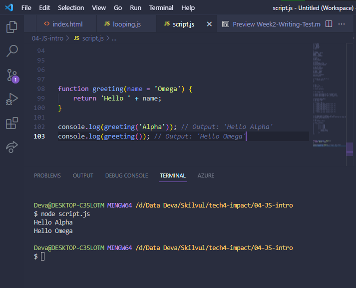

# **Writing & Presentation Test - Week 2**

## Javascript Function & Scope

### Definisi
Function adalah sebuah blok kode dalam sebuah grup untuk menyelesaikan 1 task/1 fitur.

Function ini bisa kita panggil dan gunakan saat dibutuhkan dalam menyelesaikan task/fitur.

### Mendeklarasikan Function
Function/Fungsi dapat berdiri sendiri atau disimpan di dalam sebuah variabel.

Cara mendeklarasikannya seperti ini:
```
// Fungsi yang berdiri sendiri (static)
function namaFungsi(){
  // Kode yang akan dijalankan
}

// Fungsi yang disimpan di dalam variabel
let namaVariabelFungsi = function(){
  // Kode yang akan dijalankan
}

// Fungsi arrow
let myFunction = () => {
    // Kode yang akan dijalankan
}
```
> Arrow function adalah cara lain menuliskan function. Ini adalah fitur terbaru yang ada pada ES6 (Javascript Version).

### Memanggil Function
Untuk memanggil function, kita hanya perlu menuliskan nama function yang sudah kita buat.
```
myFunction()
```
Contoh :
```
// Fungsi yang berdiri sendiri
function sapa() {
  return "Selamat Pagi!";
}

console.log(sapa()); // Output: Selamat Pagi!

// Fungsi disimpan di dalam variabel

let berkenalan = function() {
  return "Hallo, nama saya Sarah.";
};

console.log(berkenalan()); // Output: Hallo, nama saya Sarah.
```

Pada contoh kedua di atas, return value-nya adalah "Hallo, nama saya Sarah.". Bedakan `return` dengan `console.log()`.

`console.log()` hanya menampilkan informasi ke dalam tab console JavaScript, sedangkan `return` akan mengembalikan sebuah nilai ke tempat di mana fungsi itu dipanggil.

Bagaimana jika kita tidak menulis perintah return?
```
let umur = 21;

function ulangTahun() {
    umur += 1;
}

console.log(ulangTahun()); // Output: undefined
```
Fungsi tersebut tidak memiliki perintah `return`. Di JavaScript, apabila tidak ada perintah `return`, secara default fungsi tersebut akan mengembalikan nilai `undefined`.

### Parameter dan Argumen
**Parameter** adalah _syarat_ input yang harus dimasukkan ke dalam suatu fungsi dan dideklarasikan bersama dengan deklarasi fungsi.

Sementara **argumen** adalah _nilai_ yang dimasukan ke dalam suatu fungsi, sesuai dengan persyaratan parameter, di mana argumen dituliskan bersamaan dengan pemanggilan fungsi.

### Default Parameter
Default paramater digunakan untuk memberikan nilai awal/default pada parameter function.

Default parameter bisa digunakan jika kita ingin menjaga function agar tidak error saat dipanggil tanpa argumen.

Contoh :
```
function greeting(name = 'Omega') {
    return 'Hello ' + name;
}

console.log(greeting('Alpha')); // Output: 'Hello Alpha'
console.log(greeting()); // Output: 'Hello Omega'
```


### Function Hoisting
Kita bisa memanggil fungsinya terlebih dahulu sebelum kita mendeklarasikan fungsinya.

Contoh :
```
console.log(operasiPerkalian(5, 5)); // Output: 25

function operasiPerkalian(angka1, angka2) {
  return angka1 * angka2;
}
```
Normalnya kita harus mendeklarasikan fungsi terlebih dahulu, setelah itu baru kita memanggil dan menggunakan fungsi tersebut. Namun seperti contoh diatas, fungsi dipanggil terlebih dahulu menggunakan `console.log()` lalu deklarasi dilakukan setelah pemanggilan fungsi. Itulah yang disebuh dengan **Function Hoisting**.

Tapi, ini tidak berlaku jika fungsi tersebut dideklarasi di dalam sebuah variabel.

Contoh :
```
console.log(operasiPerkalian(5, 5)); // Output: Uncaught ReferenceError: Cannot access 'operasiPerkalian' before initialization

const operasiPerkalian = function(angka1, angka2) {
  return angka1 * angka2;
};
```

### Scope
Scope adalah konsep dalam flow data variabel. 
Menentukan suatu variabel bisa diakses pada scope tertentu atau tidak.

- #### Global Scope
Global scope berarti variabel yang kita buat dapat diakses dimanapun dalam suatu file.

Agar menjadi Global Scope, suatu variabel harus dideklarasikan diluar Blocks.

Contoh :
```
const olahraga = 'basketball';

function namaAtlet() {
  let atlet = 'Lionel Messi';
  const noMessi = 10;
  console.log(olahraga); // Output: basketball
  if (olahraga === 'basketball') {
     atlet = 'Kobe Bryant';
     const noKobe = 24;
     console.log(olahraga); // Output: basketball
  }
  return atlet;
}

console.log(namaAtlet()); // Output: Kobe Bryant
console.log(olahraga); // Output: basketball
```

<!-- Pada contoh di atas, fungsi variabel olahraga bisa diakses di dalam fungsi namaAtlet dan bahkan di dalam blok if walaupun variabel olahraga tidak dideklarasikan di dalam fungsi/blok tersebut. -->

<!-- Ini dikarenakan variabel olahraga yang dideklarasikan di luar fungsi namaAtlet memiliki lingkup global, jadi bisa diakses dari mana saja selama ada di dalam lingkup variabel tersebut. -->

- #### Local Scope
Local scope berarti kita mendeklarasikan variabel didalam blocks seperti function, conditional, dan looping.

Maka variabel hanya bisa diakses didalam blocks saja. Tidak bisa diakses diluar blocks.

Jadi, lingkup lokal bisa dibagi lagi menjadi dua tipe:
- lingkup fungsi (function scope)
- lingkup blok (block scope)

Contoh :
```
const olahraga = 'basketball';

function namaAtlet() {
  let atlet = 'Lionel Messi'; // lingkup fungsi
  const noMessi = 10; // lingkup fungsi
  if (olahraga === 'basketball') { 
     atlet = 'Kobe Bryant';
     const noKobe = 24; // lingkup blok
     console.log(noMessi); // Output: 10  
  }
  console.log(noKobe); // Output: Uncaught ReferenceError: noKobe is not defined
  return atlet;
}

namaAtlet();
```

<!-- Pada contoh di atas, perintah console.log(noKobe) akan mengembalikan nilai error karena kita mencoba mengakses variabel noKobe di luar lingkup di mana dia dideklarasikan (yaitu di dalam blok if saja).  -->

<!-- Sedangkan perintah console.log(noMessi) akan menghasilkan output 10 karena variabel noMessi dideklarasikan di luar blok if jadi semua kode di dalam blok if tersebut mempunyai akses ke variabel itu. -->

## Properties & Method Javascript
