# **Writing Test - Week 3**

## Array & Array Multidimensional

### Definisi

Array adalah tipe data list order atau tipe variabel yang dapat menampung berbagai jenis data dengan tipe yang bermacam-macam, dengan jumlah yang tidak terbatas. Array di JavaScript memiliki ciri khas yaitu data yang ditampung dibungkus dengan sepasang kurung siku [ ].

Array pada JavaScript dapat menyimpan fungsi, objek, dan array lainnya. Array memiliki berbagai metode dan properti yang berguna. Berikut syntax array :

```h
let namaArray = [ nilai1, nilai2, nilai3, ...];
```

Contoh penggunaan array :
```h
// Menyimpan data di variabel satu-per-satu
let murid1 = 'Deva';
let murid2 = 'Aditya';
let murid3 = 'Octavian';

// Menyimpan lebih dari satu data dalam satu array
let murid = ['Deva', 'Aditya', 'Octavian'];
```


### Mendeklarasikan Array

- #### Menggunakan Array Literal
    ```h
    let namaArray = [ element1, element2, element3 ];
    ```

    Contoh : 
    ```h
    let hewan = [ 'Kucing', 'Kelinci', 'Burung'];

    let data = ["Barang", 30000, true]; // Tipe data di array boleh berbeda
    ```

- #### MenggunakanKata Kunci `new`
    ```h
    let namaArray = new Array(element1, element2, element3);
    ```

    Contoh :
    ```h
    let hewan = new fruits('Kucing', 'Kelinci', 'Burung');

    let data = new datas("Barang", 30000, true); // Tipe data di array boleh berbeda
    ```
    > Note: Namun penulisan ini tidak direkomendasikan


### Nomor Index dan Jumlah Data Array

Setiap data di array memiliki nomor index. Nomor index berguna untuk mengakses data suatu array di posisi tertentu. Nomor index di array selalu dimulai dari angka nol (0). Setiap array pasti memiliki jumlah data yang ditampungnya, atau disebut dengan Array Length dengan syntax `array.length`.

Gambar di bawah ini adalah ilustrasi nomor index di array:

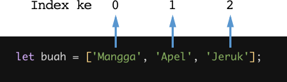


### Mengakses Data/Element di Dalam Array

- #### Mengakses Element Tunggal
    Syntax yang digunakan :
    ```h
    namaArray[nomorIndex]
    ```

    Contoh :
    ```h
    let namaHewan = ["kucing", "kelinci", "burung", "anjing"];

    console.log(namaBuah[0]); // Output: kucing
    console.log(namaBuah[1]); // Output: kelinci
    console.log(namaBuah[2]); // Output: burung
    console.log(namaBuah[3]); // Output: anjing
    ```

- #### Mengakses Element Terakhir di Array
    Sebelumnya, dijelaskan kalau nomor index dari sebuah array dimulai dari angka nol. Jadi untuk mengakses element terakhir dari sebuah array, kita bisa menggunakan formula sebagai berikut:
    ```h
    nomor index element terakhir array = jumlah data array - 1
    ```

    Contoh :
    ```h
    let countries = ["Afghanistas", "Argentina", "Australia", "Belgium", "Brazil", "Brunei", "Cameroon", "China", "Indonesia"]

    // menggunakan formula di atas
    let indexElementTerakhir = countries.length - 1;

    console.log(countries[indexElementTerakhir]); 
    // Output: Indonesia

    // atau
    console.log(countries[countries.length - 1]); 
    // Output: Indonesia
    ```

- #### Mengakses Seluruh Element Array
    Jika kita ingin mengakses seluruh data yang berada di dalam suatu array, maka kita cukup panggil nama dari array tersebut.
    ```h
    let olahraga = ["Berenang", "Sepak Bola", "Bola Basket"];

    console.log(olahraga); // Output: ["Berenang", "Sepak Bola", "Bola Basket"]
    ```

### Mengubah Data/Element pada Array

Data/element dari suatu array bisa kita ubah dengan syntax seperti ini:
```h
namaArray[nomorIndex] = nilaiBaru;
```

Contoh :
```h
let namaBuah = ["Mangga", "Apel", "Jeruk"];

namaBuah[1] = "Semangka";

console.log(namaBuah); // Output: ["Mangga", "Semangka", "Jeruk"]
```

### Const in array

Jika menggunakan let, kita dapat mengubah array  dengan array baru dan konten nilai yang ada di dalam array dengan nilai lain.

Const tidak bisa melakukan update data. Namun pada Array kita dapat melakukan update konten nilai di dalam array (mutable).

Yang tidak bisa adalah mengubah array dengan array yang baru jika menggunakan const.

Contoh :
```h
const cars = ["tesla", "honda", "toyota", "BMW"]
cars = ["nissan"]
console.log(cars);
// Output: Error. Tidak bisa update array baru
```
```h
const cars = ["tesla", "honda", "toyota", "BMW"]
cars[2] = ["nissan"]
console.log(cars);
// Output: ["tesla", "honda", "nissan", "BMW"]
```


### Array Properties

Sebelumnya sempat membahas `array.length`, yang mana ini adalah salah satu property dari array. Array memiliki 5 properti yang sering digunakan yaitu `constructor`, `length`, `index`, `input`, dan `prototype`.

Properties adalah fitur yang sudah disediakan oleh Javascript untuk memudahkan developer.
- `.length` akan mengembalikan nilai dari jumlah panjang data suatu array.
    ```h
    const cars = ["tesla", "honda", "toyota", "BMW"]
    console.log(cars.length);
    // Output: 4
    ``` 


### Array Method

Array memiliki method atau biasa disebut built-in methods. Artinya Javascript sudah memudahkan kita dengan menyediakan function/method umum yang bisa kita gunakan.


### Contoh Array Built-in Methods

- Method `.push()`, menambahkan data/value ke dalam array di index terakhir.
    ```h
    let buah = ["jeruk", "anggur", "durian", "mangga"]
    buah.push("pisang")
    console.log(buah);
    // Output: ["jeruk", "anggur", "durian", "mangga", "pisang"]
    ```
- Method `.unshift()`, menambahkan data/value ke dalam array di index pertama.
    ```h
    let buah = ["jeruk", "anggur", "durian", "mangga"]
    buah.unshift("manggis")
    console.log(buah);
    // Output: ["manggis", "jeruk", "anggur", "durian", "mangga"]
    ```
- Method `.pop()`, menghapus data/value array di index terakhir.
    ```h
    let buah = ["jeruk", "anggur", "durian", "mangga"]
    buah.pop()
    console.log(buah);
    // Output: ["jeruk", "anggur", "durian"]
    ```
- Method `.shift()`, menghapus data/value array di index pertama.
    ```h
    let buah = ["jeruk", "anggur", "durian", "mangga"]
    buah.shift()
    console.log(buah);
    // Output: ["anggur", "durian", "mangga"]
    ```
- Method `.splice()`, digunakan untuk menambah, menghapus dan mengganti data array yang diinginkan.
    
    Syntax :
    > `.splice(start, deleteCount, item1)`
    
    - start, dimulai pada index keberapa perubahan data array yg akan dilakukan.
    - deleteCount (optional), berapa data/value yang akan dihapus.
    - item1,...,item2(optional), akan diganti/disisipkan dengan data/value apa dalam index tersebut.
  
    ```h
    let buah = ["jeruk", "anggur", "durian", "mangga"]
    buah.splice(2, 0, "semangka")
    console.log(buah); 
    // Output: ["jeruk", "anggur", "semangka", "durian", "mangga"]
    ```
- Method `.sort()`, adalah method untuk mengurutkan secara Ascending atau Descending Alphanumeric
    ```h
    let number = [1, 5, 6, 7, 4]
    number.sort()
    console.log(number);
    // Output: [1, 4, 5, 6, 7]
    ```


### Looping pada Array

Array memiliki built in methods untuk melakukan looping yaitu `.map()` dan `.forEach()`

- `.forEach()`, adalah method untuk melakukan looping pada setiap elemen array. Penulisannya menggunakan callback `.forEach((item) => {})`
    ```h
    let buah = ["jeruk", "anggur", "durian", "mangga"]

    buah.forEach((item ) => {
    console.log(item);
    })
    ```
- `.map()`, melakukan perulangan/looping dengan membuat array baru.
    ```h
    let buah = ["jeruk", "anggur", "durian", "mangga"]

    let buahSegar = buah.map((item) => {
    return item + " " + "segar"
    })
    console.log(buahSegar);
    ```
    Hasil :

    

Perbedaannya dari keduanya adalah `.forEach` tidak dapat membuat Array baru dari hasil operasi yang ada dalam looping.

Jadi, gunakan `.forEach()` jika hanya memerlukan looping untuk menampilkan saja atau menyimpan ke database. Gunakan `.map()` jika akan melakukan operasi pada array seperti yang dapat mengubah nilai array sebelumnya.


### Array Multidimensional

Multidimensional Array bisa dianalogikan dengan array of array, yaitu terdapat array didalam array.

Sama seperti array satu dimensi, multidimensional array juga dapat menggunakan Property dan Method built-in Array. Cara memanggilnya menggunakan baris dan kolom.

Contoh dan hasil :
```h
let arrMulti = [
    ["nama", "alpha"],
    ["umur", 21],
    ["kelas", "JS"]
]
console.log(arrMulti);
console.log(arrMulti[0][1]);
console.log(arrMulti[2][1]);
```

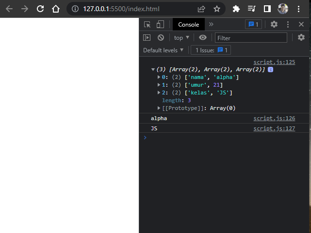

Contoh dan hasil looping dalam array multidimensional :

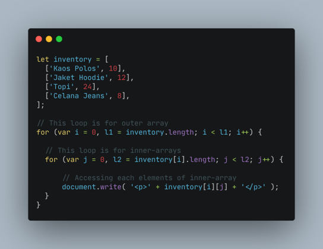


## Javascript Object


### Definisi

Dalam kehidupan nyata, kita sebenarnya sudah sering menjumpai object. Entah itu benda mati atau benda hidup. Semuanya adalah object. 

Object didunia nyata dapat kita modelkan didalam programming. Jadi pada programming, object adalah sebuah tipe data pada variabel yang menyimpan properti dan fungsi (method).

Properti adalah data lengkap dari sebuah object. Method adalah action dari sebuah object. Apa saja yang dapat dilakukan dari suatu object.

Tipe data yang sudah kita pelajari:

- number
- string
- boolean
- null
- undefined
- array
- object

Contoh object jika diilustrasikan :

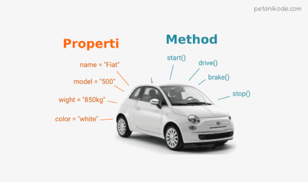


### Membuat/Mendeklarasikan Sebuah Object

Sama seperti tipe data sebelumnya. Object dapat diassign kedalam sebuah variabel. Dan sama seperti array, didalam object kita dapat menyimpan properti dengan tipe data apapun.

- Menggunakan Object Literal
    
    Syntax :
    ```h
    let nama_obj = {
        key1: "value",
        key2: "value2",
    }
    ```

    Contoh dan hasil :
    ```h
    let siswa = {
        nama: "Deva",
        umur: 21,
        hobi: "jogging",
        "nomor handphone": 0812345 
    }

    console.log(siswa);
    ```

    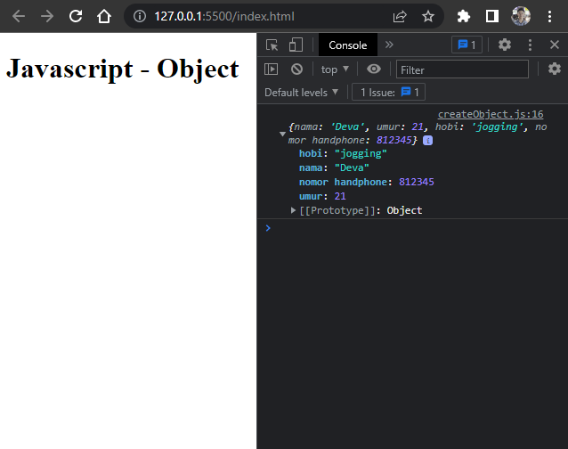

- Menggunakan Kata Kunci `new`

    Syntax :
    ```h
    let namaObjek = new Object();

    namaObjek.namaProperti1 = nilai1;
    namaObjek.namaProperti2 = nilai2;
    ```

    Contoh :
    ```h
    let orang = new Object();

    orang.nama = 'sarah';
    orang.umur = 24;
    orang.pekerjaan = 'programmer'; 
    ```


### Mengakses Object dan Property Object

Jika kita ingin menggunakan nilai yang terdapat di dalam properti suatu objek, maka kita harus mengakses properti objek tersebut.

Ada 2 cara untuk mengaksesnya :

1. Dot Notation

    Syntax :
    ```h
    let objek = {
    namaProperti: nilaiProperti
    };

    // Dot Notation
    objek.namaProperti // Output: nilaiProperti
    ```

    Contoh dan hasil :
    ```h
    let siswa = {
        nama: "Deva",
        umur: 21,
        hobi: "jogging",
        "nomor handphone": 0812345 
    }

    console.log(siswa) // Menampilkan isi keseluruhan object
    console.log(siswa.nama); // Menampilkan salah satu property dari object
    console.log(siswa.umur); // Menampilkan salah satu property dari object
    console.log(siswa.hobi); // Menampilkan salah satu property dari object
    ```

    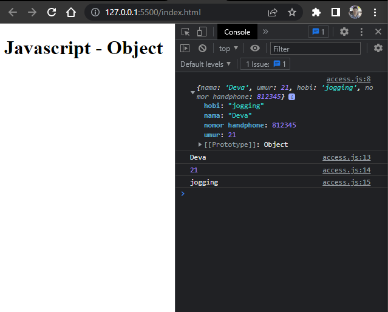

2. Bracket Notation

    Syntax :
    ```h
    let objek = {
        namaProperti: nilaiProperti
    };

    // Bracket Notation
    objek["namaProperti"] // Output: nilaiProperti

    // bisa juga menggunakan single quote
    objek['namaProperti'] // Output: nilaiProperti
    ```

    Contoh dan hasil :
    ```h
    let siswa1 = {
        nama: "Alpha",
        umur: 22,
        hobi: "futsal",
        "nomor handphone": 0812345 
    }

    console.log(siswa1); // Menampilkan isi keseluruhan object
    console.log(siswa1["nama"]); // Menampilkan salah satu property dari object
    console.log(siswa1["hobi"]); // Menampilkan salah satu property dari object
    console.log(siswa1["nomor handphone"]); // Menampilkan salah satu property dari object
    ```

    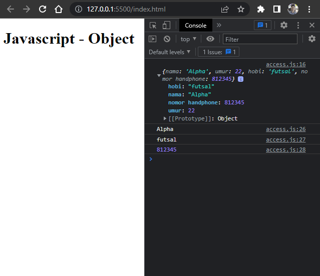

3. Tambahan, Menggunakan Variabel

    Contoh dan hasil :
    ```h
    let siswa1 = {
        nama: "Alpha",
        umur: 22,
        hobi: "futsal",
        "nomor handphone": 0812345 
    }

    console.log(siswa);
    let property = "hobi"
    console.log(siswa1[property]);
    ```

    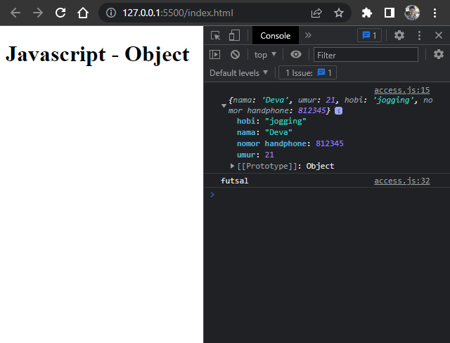


### Update Object

Kita dapat melakukan update pada variabel dengan tipe data Object. Object dapat mengupdate value dari key yang sudah tersedia. Object dapat menambahkan key dan value baru.

- Menambah Property Baru
    
    Contoh dan hasil :
    ```h
    let buku = {
        judul: "My Life My Strugel",
        penulis: "Dave",
        "jumlah halaman": 500
    }
    console.log(buku);

    // Menggunakan dot notation
    buku.tahun = 2022
    buku.penerbit = "Media Kita"
    console.log(buku);
    
    // Menggunakan bracket notation
    buku["harga"] = "Rp.92.800"
    console.log(buku);
    ```

    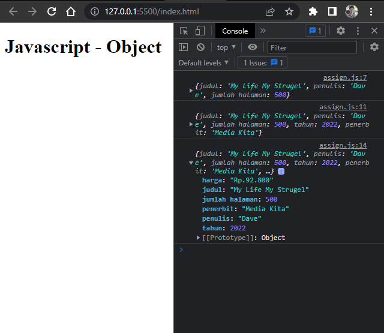

- Mengganti Value Property

  - Menggunakan Dot Notation
     
    Contoh dan hasil :
    ```h
    let hewan = {
        nama: "kucing",
        kaki: 4,
        warna: "putih"
    }
    console.log(hewan);

    hewan.nama = "kelinci"
    hewan.warna = "coklat"
    console.log(hewan);
    ```

    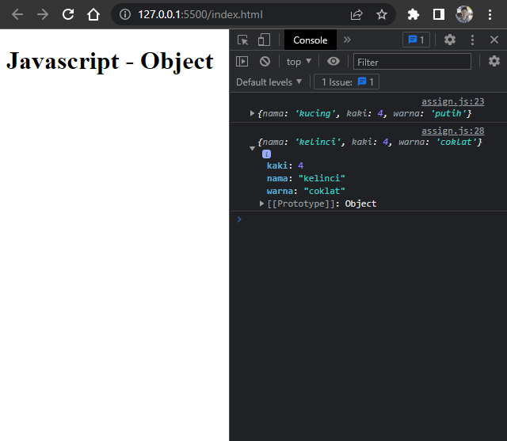

  - Menggunakan Bracket Notation

    Contoh dan hasil :
    ```h
    let hewan = {
        nama: "kucing",
        kaki: 4,
        warna: "putih"
    }
    console.log(hewan);  

    hewan["nama"] = "ayam"
    hewan["kaki"] = 2
    console.log(hewan); 
    ```
    
    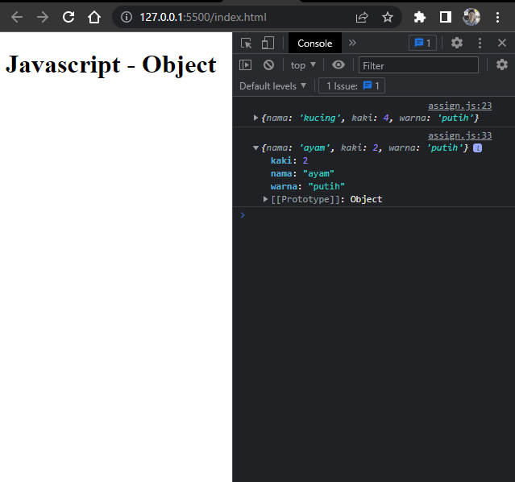

  - Mengganti Value Dalam Const

    Kita bisa mengganti/mengubah value object const selama tidak mengubah keseluruhan object tersebut.

    Contoh dan hasil :
    ```h
    const bunga = {
        nama: "Mawar"
    }
    bunga.nama = "Melati"
    console.log(bunga);
    ```

    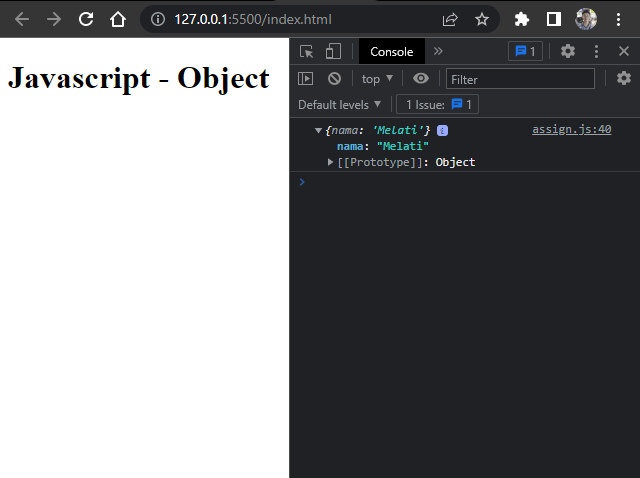

    Syntax yang tidak bisa dilakukan dalam variabel const :
    ```h
    const bunga = {
        nama: "Mawar"
    }

    bunga = { nama: "Lily"}
    bunga = "Tulip"
    ```

    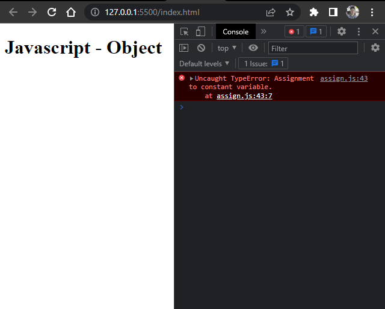


  > Jadi jika membutuhkan untuk update seluruh data object gunakan ‘let’ pada saat deklarasi variabel.


### Delete Object Property

Kita dapat menghapus properti dari object menggunakan delete operator.

Contoh dan hasil :
```h
let hewan = {
    nama: "kucing",
    kaki: 4,
    warna: "putih"
    suara: "Miaaaww"
}
console.log(hewan);

delete hewan.kaki
delete hewan.warna
console.log(hewan);
```

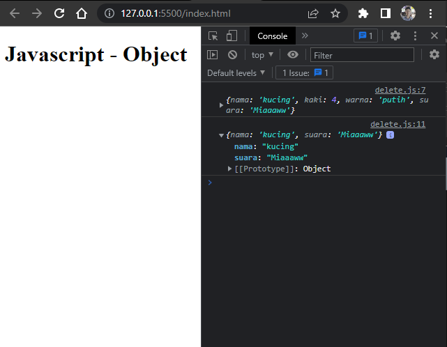


### Method

Jika value yang kita masukkan pada property berupa function. Maka itu disebut method.

Contoh dan hasil :
```h
const greeting = {
    welcome: function() {
        return "Halo, selamat datang"
    },
    afterPay: function() {
        return "Terimakasih sudah membeli produk kami!"
    }
}
console.log(greeting.welcome());
console.log(greeting.afterPay());
```

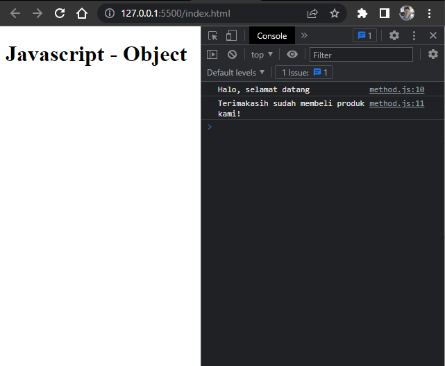

- Build-in Method Object 
  
  Contoh dan hasil :
  ```h
  let siswa = {
    nama: "Deva",
    umur: 21,
    hobi: "jogging"
  }
  console.log(siswa);

  // Merubah object menjadi array
  console.log(Object.keys(siswa));

  // Memanggil dari value
  console.log(Object.values(siswa));
  ```

  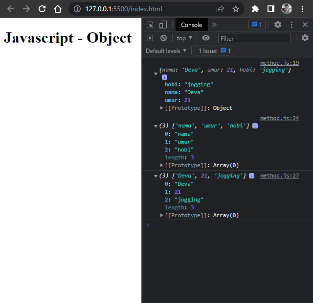


### Nested Object

Pada real application nanti kalian pasti menemukan data object yang kompleks. Object yang berasal dari turunan object lainnya.

Contoh dan hasil :
```h
let buku = {
    judul: "Cek Toko Sebelah",
    tahun: 2022,
    penulis: {
        penulis1: {
            nama: "Deva",
            umur: 21,
            kota: "bandung"
        },
        penulis2: {
            nama: "Devi",
            umur: 21,
            kota: "jakarta"
        }
    }
}
console.log(buku);

// Memanggil property
console.log(buku.penulis.penulis1.nama);
console.log(buku.penulis.penulis1.kota);
console.log(buku.penulis.penulis2.nama);
console.log(buku.penulis.penulis2.kota);
```

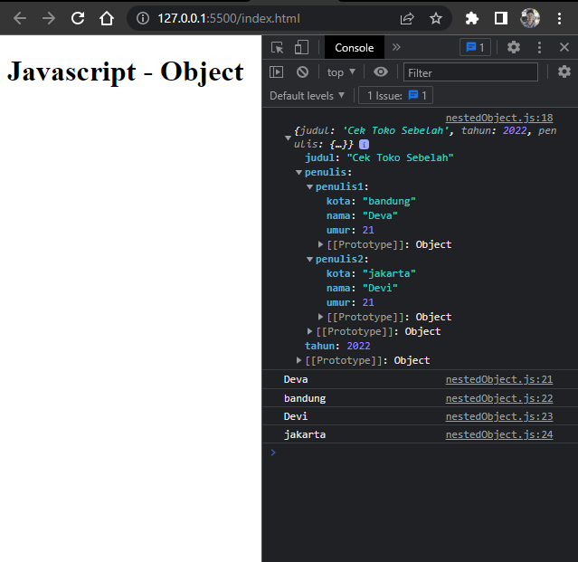


### Looping Object

Jika kita ingin menampilkan seluruh object properti. Kita bisa menggunakan looping dan tidak perlu mengakses secara manual memanggil setiap propertinya.

Looping yang digunakan adalah `for..in`.
```h
let siswa = {
    nama: "Reyhan",
    umur: 22,
    kota: "jakarta"
}
console.log(siswa);

for(let key in siswa) {
    console.log(siswa[key]); 
}
```


Contoh case lain menggunakan nested loop :
```h
let buku = {
    judul: "Cek Toko Sebelah",
    tahun: 2022,
    penulis: {
        penulis1: {
            nama: "Deva",
            umur: 21,
            kota: "bandung"
        },
        penulis2: {
            nama: "Devi",
            umur: 21,
            kota: "jakarta"
        }
    }
}
console.log(buku);

for(let key in buku.penulis.penulis1){
    console.log(buku.penulis.penulis1[key], "(ini dari nested)");
}
```

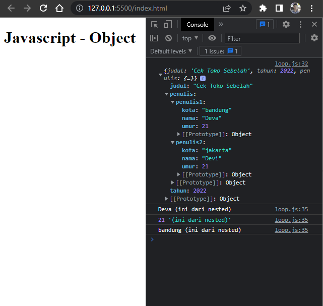


### Array of Object

Apakah object hanya menyimpan 1 data? Tidak. Object sama seperti Array yang bisa menyimpan banyak data. Kita dapat menggunakan `array of object` untuk data yang lebih dari satu.

Contoh dan hasil :
```h
let users = [
    {
        nama: "deva",
        umur: 21,
        alamat: "bandung"
    },
    {
        nama: "aditya",
        umur: 21,
        alamat: "jakarta"
    },
    {
        nama: "octavian",
        umur: 21,
        alamat: "jogja"
    }
]
console.log(users);

// cara memanggil / mengaksesnya
let data = users.map((el) => {
    console.log(el.nama);
    
// Menambahkan property baru kedalam array tersebut
    el.status = "aktif"
    return el
})
console.log(data);

// jika ingin mengambil salah satu data
console.log(users[0].nama);
```

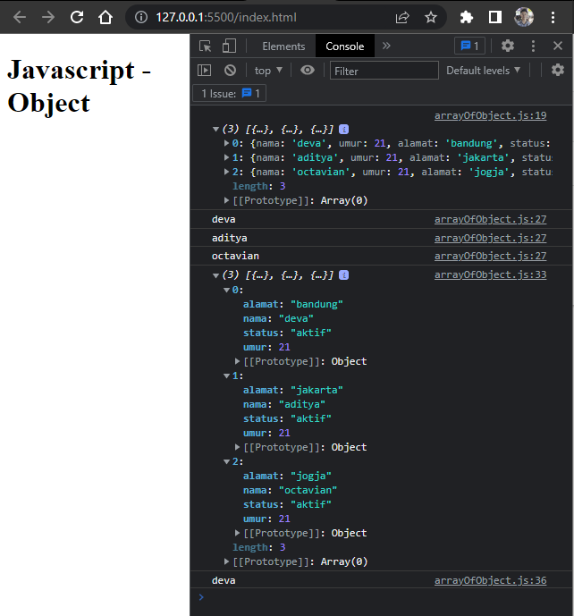