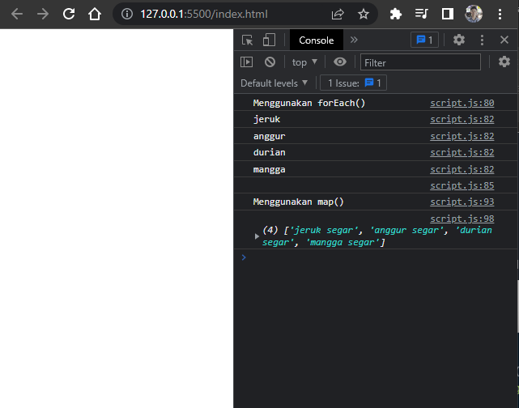

# **Writing Test - Week 3**

## Array & Array Multidimensional

### Definisi

Array adalah tipe data list order atau tipe variabel yang dapat menampung berbagai jenis data dengan tipe yang bermacam-macam, dengan jumlah yang tidak terbatas. Array di JavaScript memiliki ciri khas yaitu data yang ditampung dibungkus dengan sepasang kurung siku [ ].

Array pada JavaScript dapat menyimpan fungsi, objek, dan array lainnya. Array memiliki berbagai metode dan properti yang berguna. Berikut syntax array :

```h
let namaArray = [ nilai1, nilai2, nilai3, ...];
```

Contoh penggunaan array :
```h
// Menyimpan data di variabel satu-per-satu
let murid1 = 'Deva';
let murid2 = 'Aditya';
let murid3 = 'Octavian';

// Menyimpan lebih dari satu data dalam satu array
let murid = ['Deva', 'Aditya', 'Octavian'];
```


### Mendeklarasikan Array

- #### Menggunakan Array Literal
    ```h
    let namaArray = [ element1, element2, element3 ];
    ```

    Contoh : 
    ```h
    let hewan = [ 'Kucing', 'Kelinci', 'Burung'];

    let data = ["Barang", 30000, true]; // Tipe data di array boleh berbeda
    ```

- #### MenggunakanKata Kunci `new`
    ```h
    let namaArray = new Array(element1, element2, element3);
    ```

    Contoh :
    ```h
    let hewan = new fruits('Kucing', 'Kelinci', 'Burung');

    let data = new datas("Barang", 30000, true); // Tipe data di array boleh berbeda
    ```
    > Note: Namun penulisan ini tidak direkomendasikan


### Nomor Index dan Jumlah Data Array

Setiap data di array memiliki nomor index. Nomor index berguna untuk mengakses data suatu array di posisi tertentu. Nomor index di array selalu dimulai dari angka nol (0). Setiap array pasti memiliki jumlah data yang ditampungnya, atau disebut dengan Array Length dengan syntax `array.length`.

Gambar di bawah ini adalah ilustrasi nomor index di array:


### Mengakses Data/Element di Dalam Array

- #### Mengakses Element Tunggal
    Syntax yang digunakan :
    ```h
    namaArray[nomorIndex]
    ```

    Contoh :
    ```h
    let namaHewan = ["kucing", "kelinci", "burung", "anjing"];

    console.log(namaBuah[0]); // Output: kucing
    console.log(namaBuah[1]); // Output: kelinci
    console.log(namaBuah[2]); // Output: burung
    console.log(namaBuah[3]); // Output: anjing
    ```

- #### Mengakses Element Terakhir di Array
    Sebelumnya, dijelaskan kalau nomor index dari sebuah array dimulai dari angka nol. Jadi untuk mengakses element terakhir dari sebuah array, kita bisa menggunakan formula sebagai berikut:
    ```h
    nomor index element terakhir array = jumlah data array - 1
    ```

    Contoh :
    ```h
    let countries = ["Afghanistas", "Argentina", "Australia", "Belgium", "Brazil", "Brunei", "Cameroon", "China", "Indonesia"]

    // menggunakan formula di atas
    let indexElementTerakhir = countries.length - 1;

    console.log(countries[indexElementTerakhir]); 
    // Output: Indonesia

    // atau
    console.log(countries[countries.length - 1]); 
    // Output: Indonesia
    ```

- #### Mengakses Seluruh Element Array
    Jika kita ingin mengakses seluruh data yang berada di dalam suatu array, maka kita cukup panggil nama dari array tersebut.
    ```h
    let olahraga = ["Berenang", "Sepak Bola", "Bola Basket"];

    console.log(olahraga); // Output: ["Berenang", "Sepak Bola", "Bola Basket"]
    ```

### Mengubah Data/Element pada Array

Data/element dari suatu array bisa kita ubah dengan syntax seperti ini:
```h
namaArray[nomorIndex] = nilaiBaru;
```

Contoh :
```h
let namaBuah = ["Mangga", "Apel", "Jeruk"];

namaBuah[1] = "Semangka";

console.log(namaBuah); // Output: ["Mangga", "Semangka", "Jeruk"]
```

### Const in array

Jika menggunakan let, kita dapat mengubah array  dengan array baru dan konten nilai yang ada di dalam array dengan nilai lain.

Const tidak bisa melakukan update data. Namun pada Array kita dapat melakukan update konten nilai di dalam array (mutable).

Yang tidak bisa adalah mengubah array dengan array yang baru jika menggunakan const.

Contoh :
```h
const cars = ["tesla", "honda", "toyota", "BMW"]
cars = ["nissan"]
console.log(cars);
// Output: Error. Tidak bisa update array baru
```
```h
const cars = ["tesla", "honda", "toyota", "BMW"]
cars[2] = ["nissan"]
console.log(cars);
// Output: ["tesla", "honda", "nissan", "BMW"]
```


### Array Properties

Sebelumnya sempat membahas `array.length`, yang mana ini adalah salah satu property dari array. Array memiliki 5 properti yang sering digunakan yaitu `constructor`, `length`, `index`, `input`, dan `prototype`.

Properties adalah fitur yang sudah disediakan oleh Javascript untuk memudahkan developer.
- `.length` akan mengembalikan nilai dari jumlah panjang data suatu array.
    ```h
    const cars = ["tesla", "honda", "toyota", "BMW"]
    console.log(cars.length);
    // Output: 4
    ``` 


### Array Method

Array memiliki method atau biasa disebut built-in methods. Artinya Javascript sudah memudahkan kita dengan menyediakan function/method umum yang bisa kita gunakan.


### Contoh Array Built-in Methods

- Method `.push()`, menambahkan data/value ke dalam array di index terakhir.
    ```h
    let buah = ["jeruk", "anggur", "durian", "mangga"]
    buah.push("pisang")
    console.log(buah);
    // Output: ["jeruk", "anggur", "durian", "mangga", "pisang"]
    ```
- Method `.unshift()`, menambahkan data/value ke dalam array di index pertama.
    ```h
    let buah = ["jeruk", "anggur", "durian", "mangga"]
    buah.unshift("manggis")
    console.log(buah);
    // Output: ["manggis", "jeruk", "anggur", "durian", "mangga"]
    ```
- Method `.pop()`, menghapus data/value array di index terakhir.
    ```h
    let buah = ["jeruk", "anggur", "durian", "mangga"]
    buah.pop()
    console.log(buah);
    // Output: ["jeruk", "anggur", "durian"]
    ```
- Method `.shift()`, menghapus data/value array di index pertama.
    ```h
    let buah = ["jeruk", "anggur", "durian", "mangga"]
    buah.shift()
    console.log(buah);
    // Output: ["anggur", "durian", "mangga"]
    ```
- Method `.splice()`, digunakan untuk menambah, menghapus dan mengganti data array yang diinginkan.
    
    Syntax :
    > `.splice(start, deleteCount, item1)`
    
    - start, dimulai pada index keberapa perubahan data array yg akan dilakukan.
    - deleteCount (optional), berapa data/value yang akan dihapus.
    - item1,...,item2(optional), akan diganti/disisipkan dengan data/value apa dalam index tersebut.
  
    ```h
    let buah = ["jeruk", "anggur", "durian", "mangga"]
    buah.splice(2, 0, "semangka")
    console.log(buah); 
    // Output: ["jeruk", "anggur", "semangka", "durian", "mangga"]
    ```
- Method `.sort()`, adalah method untuk mengurutkan secara Ascending atau Descending Alphanumeric
    ```h
    let number = [1, 5, 6, 7, 4]
    number.sort()
    console.log(number);
    // Output: [1, 4, 5, 6, 7]
    ```


### Looping pada Array

Array memiliki built in methods untuk melakukan looping yaitu `.map()` dan `.forEach()`

- `.forEach()`, adalah method untuk melakukan looping pada setiap elemen array. Penulisannya menggunakan callback `.forEach((item) => {})`
    ```h
    let buah = ["jeruk", "anggur", "durian", "mangga"]

    buah.forEach((item ) => {
    console.log(item);
    })
    ```
- `.map()`, melakukan perulangan/looping dengan membuat array baru.
    ```h
    let buah = ["jeruk", "anggur", "durian", "mangga"]

    let buahSegar = buah.map((item) => {
    return item + " " + "segar"
    })
    console.log(buahSegar);
    ```
    Hasil :

    

Perbedaannya dari keduanya adalah `.forEach` tidak dapat membuat Array baru dari hasil operasi yang ada dalam looping.

Jadi, gunakan `.forEach()` jika hanya memerlukan looping untuk menampilkan saja atau menyimpan ke database. Gunakan `.map()` jika akan melakukan operasi pada array seperti yang dapat mengubah nilai array sebelumnya.


### Array Multidimensional

Multidimensional Array bisa dianalogikan dengan array of array, yaitu terdapat array didalam array.

Sama seperti array satu dimensi, multidimensional array juga dapat menggunakan Property dan Method built-in Array. Cara memanggilnya menggunakan baris dan kolom.

Contoh dan cara memanggil :

```h
let arrMulti = [
    ["nama", "alpha"],
    ["umur", 21],
    ["kelas", "JS"]
]
console.log(arrMulti);
console.log(arrMulti[0][1]);
console.log(arrMulti[2][1]);
```

Hasil :


Contoh looping dalam array multidimensional :


Hasil :

