# **Writing Test - Week 4**

## _Async-Await_

### Definisi

Selain menggunakan _callback_ dan _promise_, kita juga bisa menggunakan async/await untuk menggunakan _asynchronous_ pada JavaScript. _Async/await_ baru ada ketika update _ES8_ JavaScript dan dibangun menggunakan _promise_. Jadi sebenarnya _async/await_ dan _promise_ itu sama saja, namun hanya berbeda dari syntax dan cara penggunaannya.

Ada 2 kata kunci yang memiliki pengertian sebagai berikut:

- _async_, mengubah function _synchronous_ menjadi _asynchronous_.
- _await_, menunda eksekusi hingga proses _asynchronous_ selesai.

Sebuah _async function_ bisa tidak berisi _await_ sama sekali atau lebih dari satu _await_. Keyword _await_ hanya bisa digunakan didalam _async function_, jika digunakan di luar _async function_ maka akan terjadi error.

### _Async_

```h
// async menggunakan keyword function 
async function tesAsyncAwait() {
  return "Fulfilled";
}

console.log(tesAsyncAwait());
```

```h
// async menggunakan arrow function
const tesAsyncAwait = async () => {
  return "Fulfilled";
};

console.log(tesAsyncAwait());
```

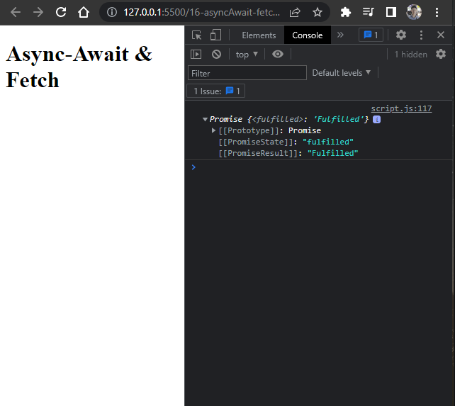

### _Await_

_await_ hanya bisa digunakan dalam _async function_ dan _await_ adalah keyword dalam _async_ yang digunakan untuk menunda hingga proses _asynchronous_ selesai.

Syntax :

```h
async function tesAsyncAwait() {
   await 'Fulfilled';
}
```

Kita juga bisa memberikan _error handling_ pada _async/await_. Contoh penggunaan _async/await_ :

```h
// membuat promise
let nonton = (kondisi) => {
    return new Promise((resolve, reject) => {
      if (kondisi == "jalan") {
        resolve("nonton terpenuhi")
      }
      reject("batal nonton")
    })
}

// buat async function
async function asyncNonton() {
    try {
        let result = await nonton("jalan")    
        console.log(result);
    } catch (error) {
        console.log(error);
    }
}
asyncNonton()
```

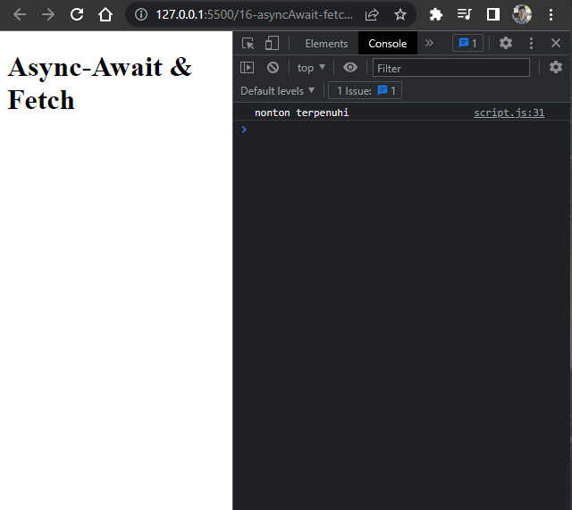

Menggunakan _promise_ biasa (then catch) :

```h
// membuat promise
let nonton = (kondisi) => {
    return new Promise((resolve, reject) => {
      if (kondisi == "jalan") {
        resolve("nonton terpenuhi")
      }
      reject("batal nonton")
    })
}

// then catch
nonton("tidur")
.then(result => {
    console.log(result);
}).catch(error => {
    console.log(error);
})
```

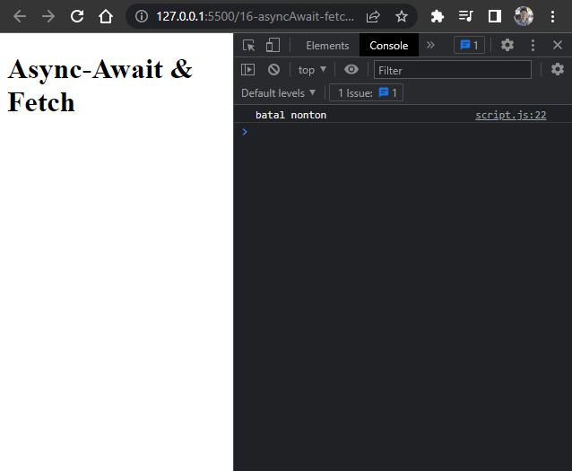

## _Fetch_

Dalam JavaScript kita bisa mengirimkan _network request_ dan juga bisa mengambil informasi data terbaru dari server jika dibutuhkan.

Contoh _network request_ yang bisa dilakukan :

- Mengirimkan data dari sebuah _form_.
- Mengambil data untuk ditampilkan dalam _list/table_.
- Mendapatkan notifikasi.

Dalam melakukan _network request_, JavaScript memiliki metode bernama `fetch()`.

Proses melakukan `fetch()` adalah salah satu proses _asynchronous_ di JavaScript sehingga kita perlu menggunakan salah satu diantara _promise_ atau _async/await_.

_fetch_ dengan _promise_ :

```h
fetch("https://digimon-api.vercel.app/api/digimon")
.then(result => {
    console.log(result);
    return result.json()
})
.then(result => {
    console.log(result);
})
.catch(error => {
    console.log(error);
})
```

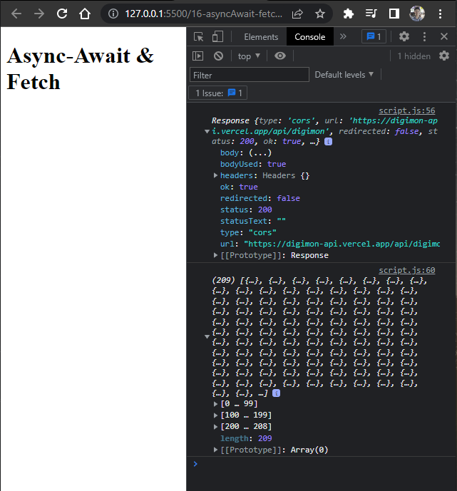

_fetch_ dengan _async-await_ :

```h
let getDataDigimon = async () => {
    let response = await fetch("https://digimon-api.vercel.app/api/digimon")
    let result = await response.json()
    console.log(result);
}
getDataDigimon()
```

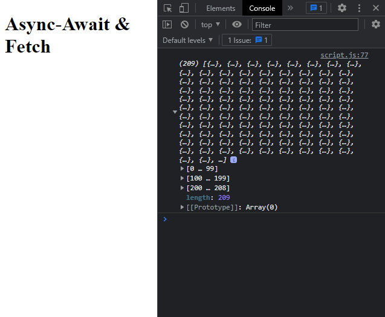

_fetch_ data di internet dan menambahkan _DOM_ :

```h
let containerDigimon = document.getElementById("list-digimon")

let getDataDigimon = async () => {
    let response = await fetch("https://digimon-api.vercel.app/api/digimon")
    let digimons = await response.json()
    
    digimons.slice(0, 5).forEach((item, index) => {
        containerDigimon.innerHTML += 
        `<div>
        
        <h3>${item.name}</h3>
        </div>`

        console.log(item);
    })
}
getDataDigimon()
```

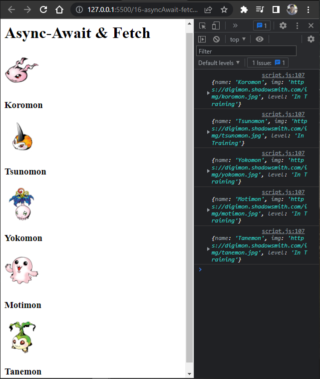

## Git & Github Lanjutan

Sebelumnya kita sudah membahas tentang _git_ dan _github_ pada _writing_ week-1, kita bisa menyimpan hasil coding atau project kita kedalam sebuah _repository_ penyimpanan secara online dengan menggunakan _github_ yang bersifat _cloud_. 

Dengan menggunakan _git_ dan _github_ juga, kita bisa berkolaborasi dengan teman / anggota tim lain dalam mengerjakan sebuah project dalam 1 _repository_.

Beberapa _command_ atau perintah yang dapat digunakan diantaranya adalah :

- #### git clone

    Perintah ini digunakan jika kita ingin menduplikasi atau mendapatkan sebuah _repository_ yang sudah ada ke dalam _directory_ kita yang sudah terhubung dengan git.

    > git clone `https://<url git repository url>`

    Kita tidak perlu melakukan perintah `git remote` lagi karena dengan perintah `git clone` sudah otomatis terhubung antara _repository local_ dengan _remote repository_.

- #### git remote

    Perintah `git remote` akan membuat user terhubung ke _remote repository_. Perintah berikut ini akan menampilkan _repository_ yang sedang dikonfigurasi

    > git remote -v

    Perintah ini membuat user bisa menghubungkan repository lokal ke remote server:

    > git remote add `https://<url git repository url>`

- #### git pull

    Perintah `git pull` akan mengambil commit terbaru lalu otomatis menggabungkan (_merge_) dengan branch yang aktif.

    > git pull origin `<nama-branch>`

    Jika dalam tim kita berperan sebagain _tim lead_, maka kita akan menerima pull request dari anggota tim lain seperti contoh dibawah :

    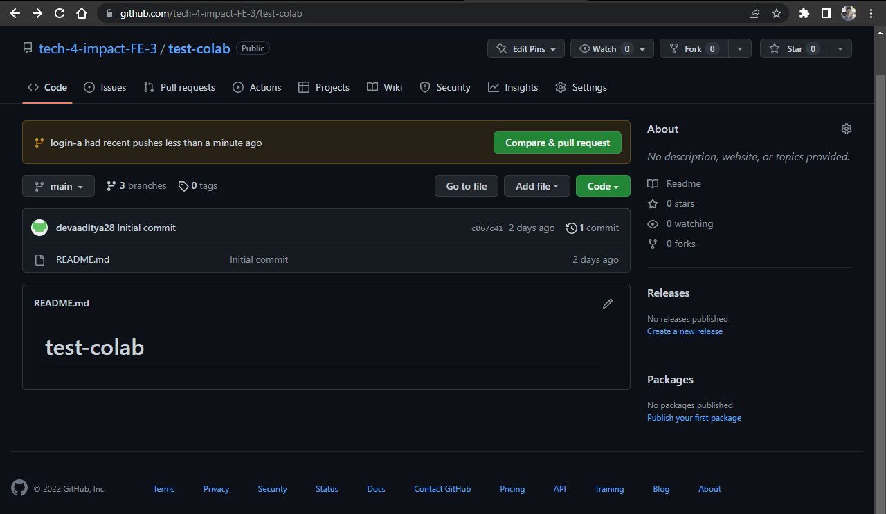

    Apabila perubahan atau code sudah sesuai maka bisa langsung melakukan _pull request_ dan _merge_.

    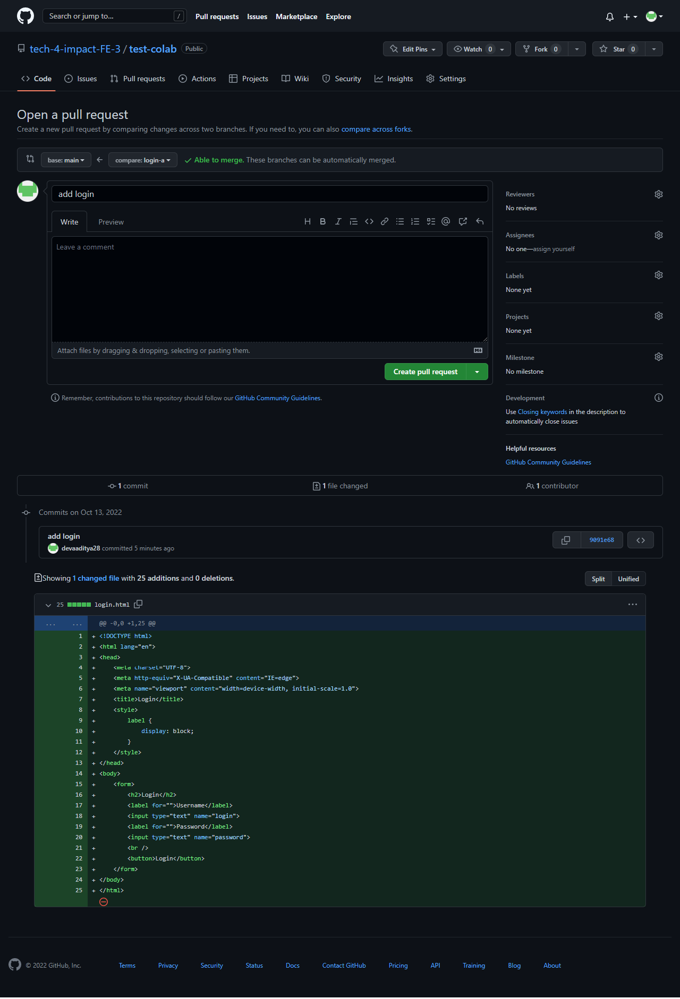

    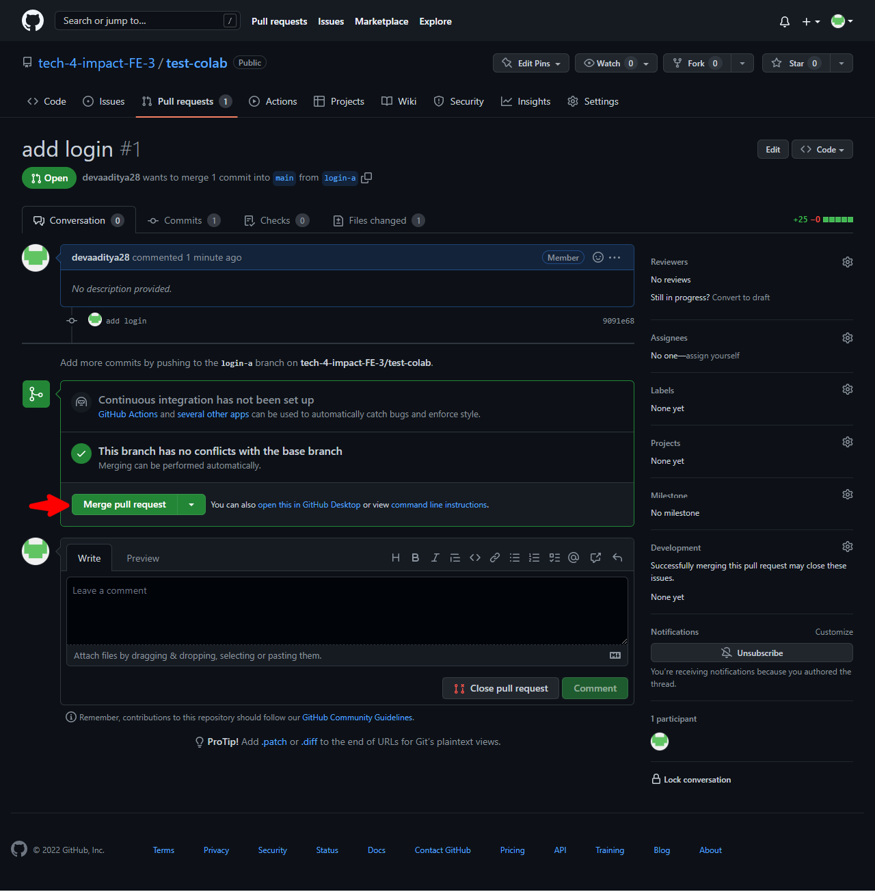

    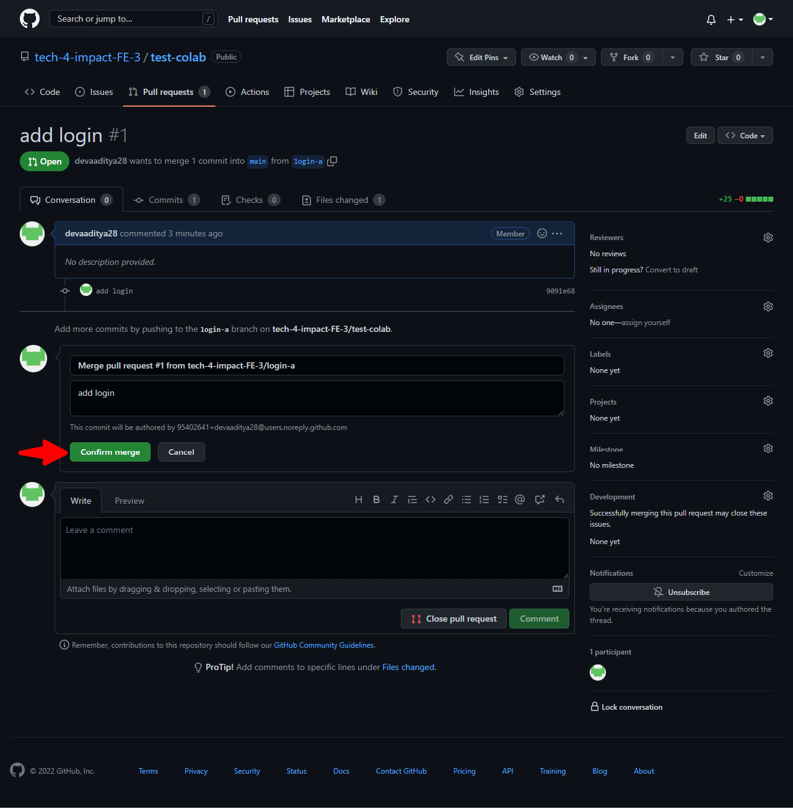

- #### git fetch

    Perintah `git fetch` akan mengambil _commit_ terbaru saja. Perintah `git fetch` tidak akan langsung melakukan _merge_.

    > git fetch origin `<nama-branch>`

- #### git merge

    Perintah merge digunakan untuk menggabungkan sebuah branch ke branch aktif.

    > git merge `<nama-branch>`

Dalam berkolaborasi terkadang kita akan mendapatkan sebuah _conflict_ dikarenakan ada lebih dari satu orang yang melakukan perubahan pada pada file dan baris yang sama. Sehingga pada saat akan melakukan `push` ke _remote repository_ atau melakukan `pull request` akan mendapatkan notifikasi bahwa terdapat _conflict_. 

Jika menghadapi permasalahan seperti ini, kita harus _meresolve_ atau menyelesaikannya terlebih dahulu. Kita harus berdiskusi dengan anggota tim karena harus memilih code mana yang akan dipakai. Dan untuk menghindari _conflict_ kita bisa melakukan `git pull` sebelum melakukan _coding_ atau perubahan.

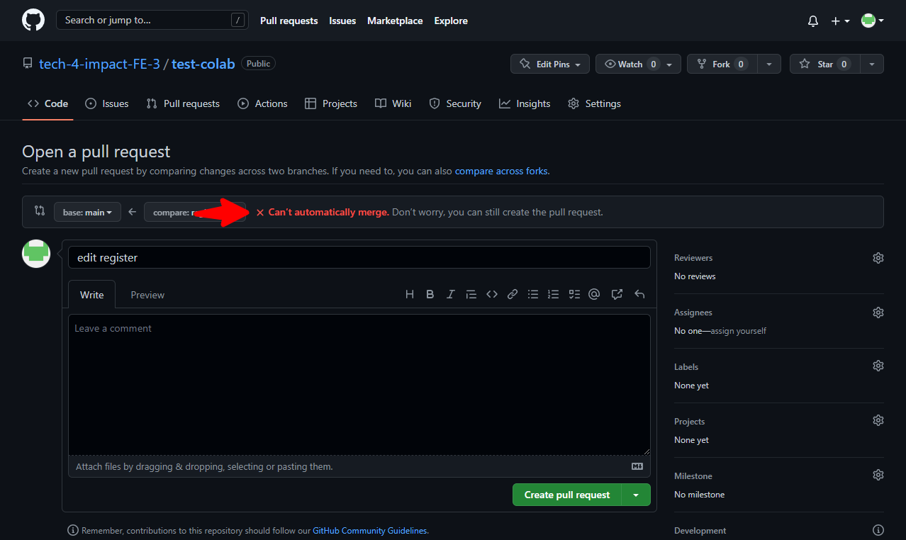

Jika tetap membuat `pull request` maka kita diminta untuk melakukan _resolve_ terlebih dahulu

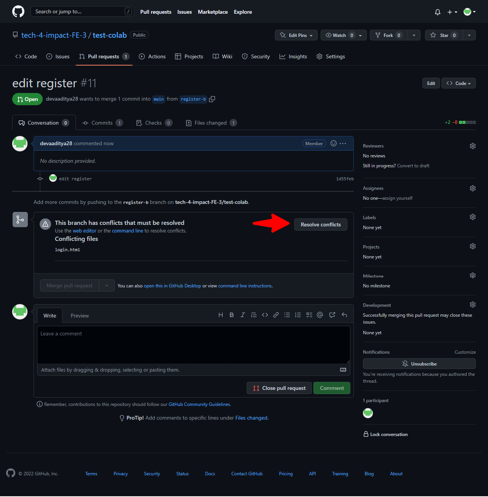

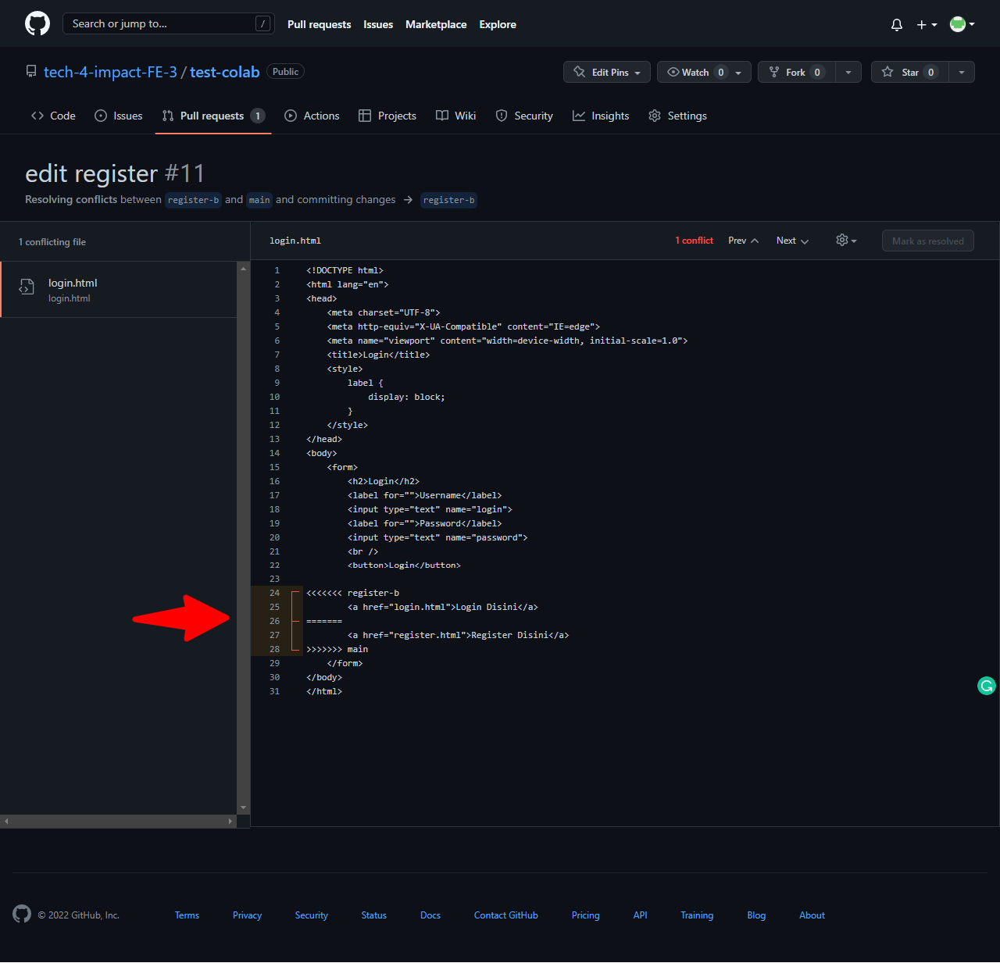

Jika sudah melakukan _resolve_, kita bisa klik `Mark as resolved` dan `commit merge`

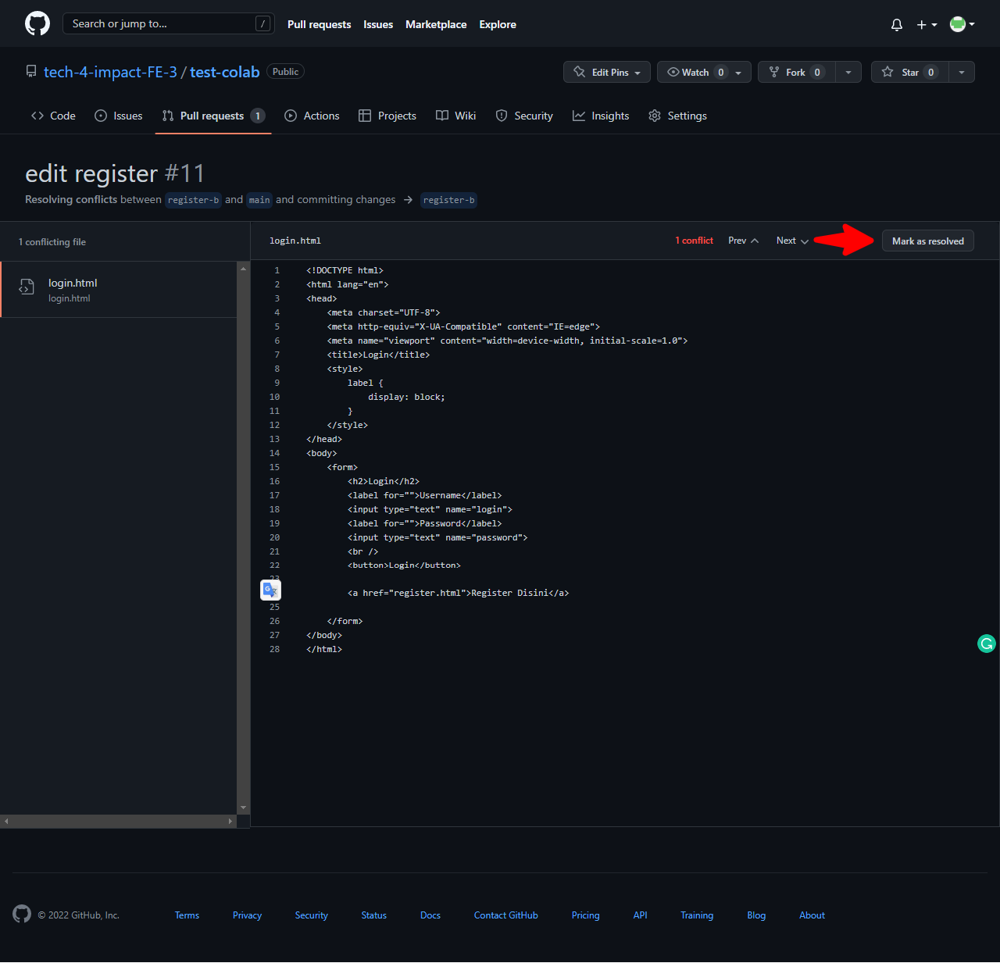

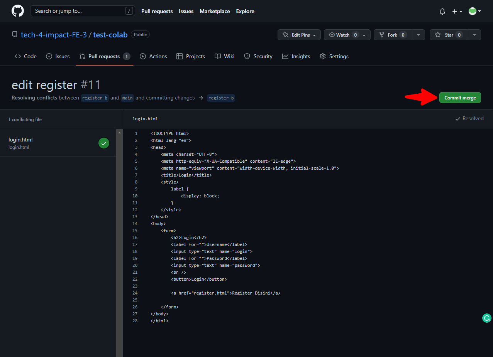

Selanjutnya akan muncul notif bahwa berhasil melakukan _resolve_ dan bisa melanjutkan `pull request`

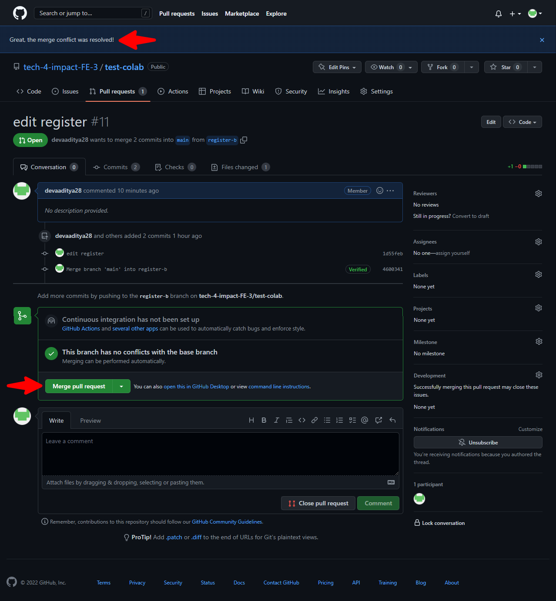

Terakhir, `pull request & merge` pun berhasil dilakukan

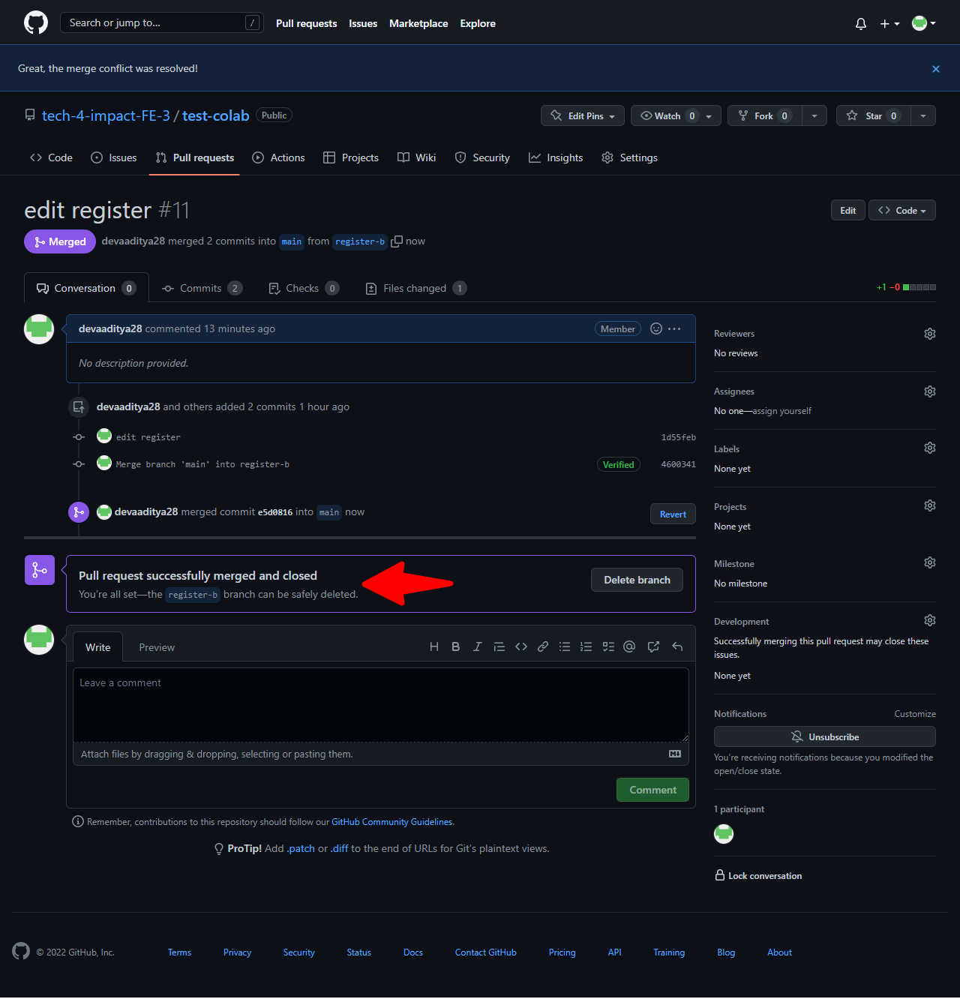