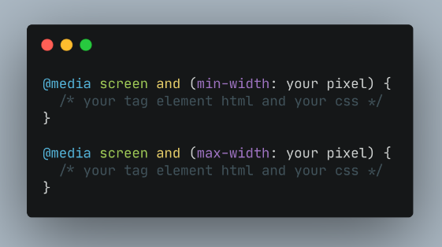
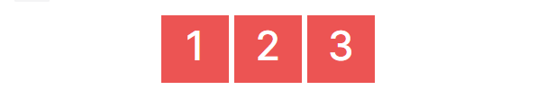

# **Writing Test - Week 4**

## _Async-Await_

### Definisi

Selain menggunakan _callback_ dan _promise_, kita juga bisa menggunakan async/await untuk menggunakan _asynchronous_ pada JavaScript. _Async/await_ baru ada ketika update _ES8_ JavaScript dan dibangun menggunakan _promise_. Jadi sebenarnya _async/await_ dan _promise_ itu sama saja, namun hanya berbeda dari syntax dan cara penggunaannya.

Ada 2 kata kunci yang memiliki pengertian sebagai berikut:

- _async_, mengubah function _synchronous_ menjadi _asynchronous_.
- _await_, menunda eksekusi hingga proses _asynchronous_ selesai.

Sebuah _async function_ bisa tidak berisi _await_ sama sekali atau lebih dari satu _await_. Keyword _await_ hanya bisa digunakan didalam _async function_, jika digunakan di luar _async function_ maka akan terjadi error.

### _Async_

```h
// async menggunakan keyword function 
async function tesAsyncAwait() {
  return "Fulfilled";
}

console.log(tesAsyncAwait());
```

```h
// async menggunakan arrow function
const tesAsyncAwait = async () => {
  return "Fulfilled";
};

console.log(tesAsyncAwait());
```


### _Await_

_await_ hanya bisa digunakan dalam _async function_ dan _await_ adalah keyword dalam _async_ yang digunakan untuk menunda hingga proses _asynchronous_ selesai.

Syntax :

```h
async function tesAsyncAwait() {
   await 'Fulfilled';
}
```

Kita juga bisa memberikan _error handling_ pada _async/await_. Contoh penggunaan _async/await_ :

```h
// membuat promise
let nonton = (kondisi) => {
    return new Promise((resolve, reject) => {
      if (kondisi == "jalan") {
        resolve("nonton terpenuhi")
      }
      reject("batal nonton")
    })
}

// buat async function
async function asyncNonton() {
    try {
        let result = await nonton("jalan")    
        console.log(result);
    } catch (error) {
        console.log(error);
    }
}
asyncNonton()
```


Menggunakan _promise_ biasa (then catch) :

```h
// membuat promise
let nonton = (kondisi) => {
    return new Promise((resolve, reject) => {
      if (kondisi == "jalan") {
        resolve("nonton terpenuhi")
      }
      reject("batal nonton")
    })
}

// then catch
nonton("tidur")
.then(result => {
    console.log(result);
}).catch(error => {
    console.log(error);
})
```


## _Fetch_

Dalam JavaScript kita bisa mengirimkan _network request_ dan juga bisa mengambil informasi data terbaru dari server jika dibutuhkan.

Contoh _network request_ yang bisa dilakukan :

- Mengirimkan data dari sebuah _form_.
- Mengambil data untuk ditampilkan dalam _list/table_.
- Mendapatkan notifikasi.

Dalam melakukan _network request_, JavaScript memiliki metode bernama `fetch()`.

Proses melakukan `fetch()` adalah salah satu proses _asynchronous_ di JavaScript sehingga kita perlu menggunakan salah satu diantara _promise_ atau _async/await_.

_fetch_ dengan _promise_ :

```h
fetch("https://digimon-api.vercel.app/api/digimon")
.then(result => {
    console.log(result);
    return result.json()
})
.then(result => {
    console.log(result);
})
.catch(error => {
    console.log(error);
})
```


_fetch_ dengan _async-await_ :

```h
let getDataDigimon = async () => {
    let response = await fetch("https://digimon-api.vercel.app/api/digimon")
    let result = await response.json()
    console.log(result);
}
getDataDigimon()
```


_fetch_ data di internet dan menambahkan _DOM_ :

```h
let containerDigimon = document.getElementById("list-digimon")

let getDataDigimon = async () => {
    let response = await fetch("https://digimon-api.vercel.app/api/digimon")
    let digimons = await response.json()
    
    digimons.slice(0, 5).forEach((item, index) => {
        containerDigimon.innerHTML += 
        `<div>
        
        <h3>${item.name}</h3>
        </div>`

        console.log(item);
    })
}
getDataDigimon()
```


## Git & Github Lanjutan

Sebelumnya kita sudah membahas tentang _git_ dan _github_ pada _writing_ week-1, kita bisa menyimpan hasil coding atau project kita kedalam sebuah _repository_ penyimpanan secara online dengan menggunakan _github_ yang bersifat _cloud_. 

Dengan menggunakan _git_ dan _github_ juga, kita bisa berkolaborasi dengan teman / anggota tim lain dalam mengerjakan sebuah project dalam 1 _repository_.

Beberapa _command_ atau perintah yang dapat digunakan diantaranya adalah :

- #### git clone

    Perintah ini digunakan jika kita ingin menduplikasi atau mendapatkan sebuah _repository_ yang sudah ada ke dalam _directory_ kita yang sudah terhubung dengan git.

    > git clone `https://<url git repository url>`

    Kita tidak perlu melakukan perintah `git remote` lagi karena dengan perintah `git clone` sudah otomatis terhubung antara _repository local_ dengan _remote repository_.

- #### git remote

    Perintah `git remote` akan membuat user terhubung ke _remote repository_. Perintah berikut ini akan menampilkan _repository_ yang sedang dikonfigurasi

    > git remote -v

    Perintah ini membuat user bisa menghubungkan repository lokal ke remote server:

    > git remote add `https://<url git repository url>`

- #### git pull

    Perintah `git pull` akan mengambil commit terbaru lalu otomatis menggabungkan (_merge_) dengan branch yang aktif.

    > git pull origin `<nama-branch>`

    Jika dalam tim kita berperan sebagain _tim lead_, maka kita akan menerima pull request dari anggota tim lain seperti contoh dibawah :

    

    Apabila perubahan atau code sudah sesuai maka bisa langsung melakukan _pull request_ dan _merge_.

    

    

    

- #### git fetch

    Perintah `git fetch` akan mengambil _commit_ terbaru saja. Perintah `git fetch` tidak akan langsung melakukan _merge_.

    > git fetch origin `<nama-branch>`

- #### git merge

    Perintah merge digunakan untuk menggabungkan sebuah branch ke branch aktif.

    > git merge `<nama-branch>`

Dalam berkolaborasi terkadang kita akan mendapatkan sebuah _conflict_ dikarenakan ada lebih dari satu orang yang melakukan perubahan pada pada file dan baris yang sama. Sehingga pada saat akan melakukan `push` ke _remote repository_ atau melakukan `pull request` akan mendapatkan notifikasi bahwa terdapat _conflict_. 

Jika menghadapi permasalahan seperti ini, kita harus _meresolve_ atau menyelesaikannya terlebih dahulu. Kita harus berdiskusi dengan anggota tim karena harus memilih code mana yang akan dipakai. Dan untuk menghindari _conflict_ kita bisa melakukan `git pull` sebelum melakukan _coding_ atau perubahan.


Jika tetap membuat `pull request` maka kita diminta untuk melakukan _resolve_ terlebih dahulu


Jika sudah melakukan _resolve_, kita bisa klik `Mark as resolved` dan `commit merge`


Selanjutnya akan muncul notif bahwa berhasil melakukan _resolve_ dan bisa melanjutkan `pull request`


Terakhir, `pull request & merge` pun berhasil dilakukan


## Responsive Web Design

### Definisi

Responsive Web Design (RWD) bertujuan membuat desain _website_ kita dapat diakses dalam device apapun. Device yang umum digunakan adalah **laptop/PC, smartphone dan tablet**. 

### Setting up Chrome Dev Tools

Setiap _developer web_ wajib menggunakan _tools_ bawaan dari setiap browser yang memudahkan proses _development website_. Pada _browser chrome_ biasa disebut dengan **Chrome Dev Tools**.

Cara mengaksesnya bisa dengan shortcut pada _windows_ `Ctrl` + `Shift` + `J` atau klik kanan dan pilih _inspect_. Lalu pilih _icon phone & tablet_.


### Viewport

Secara umum viewport adalah daerah pada layar yang menampilkan suatu konten. Dalam konteks kita kali ini, tentu viewport adalah daerah yang menampilkan halaman web yang sedang kita akses.

Perlu kalian ingat bahwa ukuran viewport tidak selalu sama dengan resolusi layar perangkat.

Coba kalian cermati tangkapan layar berikut.


Gambar di kiri merupakan tangkapan layar pada komputer; gambar di kanan pada smartphone.

Kotak berwarna hijau mewakili keseluruhan layar perangkat. Namun area yang kita sebut viewport tadi itu digambarkan oleh kotak berwarna biru.

Kembali ke permasalahan di awal: Bagaimana kita membuat halaman web kita menjadi responsif? Bagaimana kita memastikan halaman web yang kita buat nanti itu tidak terlihat buruk atau terlalu besar pada perangkat mobile?

Untuk membuat halaman website menjadi responsif, maka kita perlu menambahkan meta data berikut ini di dalam element `<head>` di file HTML.

```h
<meta name="viewport" content="width=device-width, initial-scale=1.0" />
```

Meta data di atas akan mengatur viewport dari halaman website, di mana meta data tersebut akan memberikan instruksi kepada browser untuk mengatur bagaimana dimensi dan skala dari halaman website kita.
1. **width=device-width** memberitahu browser untuk mengikuti lebar layar dari perangkatnya. Sebab lebar layar tiap perangkat berbeda-beda.
2. **initial-scale=1.0** memberitahu browser tingkat pembesaran (zoom level) dari halaman itu.

### Relative Unit

Relative unit berguna untuk mendesain website yang responsif karena ukurannya bisa berubah relatif terhadap parent atau ukuran layar.

Secara umum relative unit bisa dipakai sebagai satuan bawaan website responsif sehingga bisa membantu untuk meng-update style di ukuran layar yang berbeda.

Relative unit mungkin akan sedikit lebih sulit dibandingkan absolute unit untuk menentukan satuan mana yang akan dipakai. 

Tidak ada standar resmi kapan waktu terbaik menggunakan satuan-satuann dari relative unit ini. Berikut beberapa contohnya.

- **%** : Ukurannya relatif terhadap parent element.
- **em** : Ukurannya relatif terhadap font-size dari elemen saat ini.
- **rem** : Ukurannya relatif terhadap font-size root elemen `<html>`. `"rem" = "root em"`.
- **ch** : Ukurannya mengikuti jumlah karakter (1 karakter sama dengan lebar dari karakter 0/nol font yang sedang aktif)
- **vh** : Ukurannya relatif terhadap tinggi viewport (ukuran jendela tau aplikasi), 1vh = 1/100 dari tinggi viewport
- **vw** : Ukurannya relatif terhadap lebar dari viewport. 1vw = 1/100 lebar viewport
- **vmin** : Ukurannya relatif terhadap ukuran viewport yang lebih kecil (misalnya diorientasi portrait, lebar akan lebih kecil daripada tinggi). 1vmin = 1/100 dari ukuran viewport yang lebih kecil.
- **vmax** : Sama dengan vmin, dia akan melihat ukuran viewport yang lebih besar
- **ex** : Ukurannya relatif terhadap tinggi dari karakter "x" kecil font yang sedang aktif.

### Media Query

_Media query_ merupakan modul CSS3 yang berguna membuat layout kita responsive dengan menyesuaikan tampilan berdasarkan ukuran layar perangkat. 

_Media query_ juga disebut dengan _Breakpoint_, karena cara kerja _media query_ yakni dengan cara mengecheck ukuran _viewport_(layar/area dimana konten terlihat) apakah sesuai dengan kondisi yang kita deklarasikan, jika benar maka kode dalam kondisi tersebut yang akan dieksekusi. Dengan kata lain _media query_ memberikan kemampuan menggunakan kode css yang sesuai dengan kondisi yang ditentukan.

_Breakpoint_ sendiri merupakan perubahan yang terjadi pada tampilan saat berganti _device_ atau ukuran width. _Media query_ untuk _responsive web design_ umumnya hanya menggunakan 2 jenis _media query_, yaitu **min-width** dan **max-width**.



- #### Eksternal & Internal Media Query

Ada 2 cara dalam menggunakan media query

1. Dengan menggunakan tag `<link>` di dalam elemen `head`.

    Contoh :

    ```h
    <head>
    <link rel=”stylesheet” media=”screen and (min-width: 600px)” href=”laptop_styles.css”>
    <link rel=”stylesheet” media=”screen and (min-width: 320px) and (max-width: 360)” href=”mobile_styles.css”>
    </head>
    ```

2. Kita definisikan dengan rule `@media` di dalam internal css atau file css terpisah.

    Contoh :

    ```h
    @media screen and (min-width: 240px) and (max-width: 480px) {
    p {
        font-size: 11px;
    }
    }
    ```

- #### Logika dalam CSS Media Query

Secara basic cara kerja _media query_ menentukan, jika kondisi pernyataan benar (_true_) maka rules CSS kita akan diaplikasikan.

> `And`, agar rules kita dapat dieksekusi maka pernyataan kita harus bernilai benar secara berturut-turut.

Contoh :

```h
@media (min-width: 500px) and (max-width: 780px) {
body {
    font-size: 16px;
    background-color: red;
}
}
```

> `Or`, dalam media query operator or dilambangkan dengan tanda baca `koma (,)`. Rules dengan logika `or` memiliki arti dapat dieksekusi jika salah satu diantara pernyataannya benar.

Contoh :

```h
@media (min-width: 500px), (max-width: 780px) {
body {
    font-size: 16px;
    background-color: red;
}
}
```

> `Only`, berfungsi untuk mencegah browser lama untuk menyentuh style untuk _Android_ atau _iPhone_. Rules CSS hanya dapat dieksekusi jika semua _query_ bernilai benar. Syarat menggunakan `only` adalah kita harus mengikut sertakan _media type_.

Contoh :

```h
@media only screen and (min-width: 240px) and (max-width: 480px) {
body {
    font-size: 16px;
    background-color: red;
}
}
```

- #### Media Type

>`all`, Rules CSS kita cocok di semua jenis devices.

>`print`, Style kita dimaksudkan untuk ditampilkan pada dokumen cetak atau _print preview_.

>`screen`, Nilai _default media type_. Style kita dikhususkan untuk tampilan layar. 

>`speech`, _Device_ yang memiliki kapabilitas `speech`.

- #### Media Features

Untuk menentukan kondisi kita bisa menyertakan _media features_ di bawah ini dengan nilai batas nantinya sebuah rules akan dieksekusi. _Media features_ harus berada dalam tanda kurung `()`. 
```h
width
height
min-width
max-width
device-width
device-height
aspect-ratio
device-aspect-ratio
color
color-index
monochrome
resolution
orientation
scan
grid
```

> Notes: Tidak ada aturan baku besaran _width_ dan berapa banyak _breakpoint_ yang harus dilakukan. _Responsive web design_ dilakukan sesuai dengan kebutuhan konten kita.

### Flexbox

Ada dua istilah penting saat belajar _flexbox_ :

1. **container** adalah element yang membungkus dan mengatur tampilan dari element di dalamnya,
2. **item** adalah element dalam container yang diatur tampilannya.

Salah satu properti yang sering digunakan dalam implementasi _flexbox_ adalah **justify-content** yang digunakan untuk mengatur tata letak dan ruang di antara item tersebut. Perhatikan kode berikut:

```h
<!DOCTYPE html>
<html>

<head>
	<style>
        html, body, #flex-container {
            height: 100%;
        }
		#flex-container {
			display: flex;
			flex-direction:row;
			justify-content: flex-start;
		}
		.flex-item {
			width: 100px;
			height: 100px;
			margin: 4px;
			background: #ec5453;
			font-size: 60px;
			color: white;
			text-align: center;
		}
	</style>
</head>

<body>
	<div id="flex-container">
		<div class="flex-item">1</div>
		<div class="flex-item">2</div>
		<div class="flex-item">3</div>
	</div>
</body>

</html>
```

Ini akan menghasilkan tiga buah persegi berukuran 100px seperti ini:


Properti `justify-content` bisa diisi dengan satu dari beberapa nilai berikut:

- **flex-start** - semua item akan ditempatkan di depan seperti pada gambar di atas.

- **flex-end** - semua item akan ditempatkan di belakang seperti ini:
  
    

- **center** akan memampatkan semua item ke tengah:

    

- **space-between** akan memberi ruang pada setiap dua item yang bersebelahan:

    

- **space-around** akan memberi ruang pada sekitar tiap item:

    

## Bootstrap 5

### Definisi

_Bootstrap_ adalah sebuah _framework_ yang paling populer digunakan untuk membuat sebuah _website_. _Bootstrap_ membuat _front-end developer_ dapat membuat _website_ dengan cepat, fokus pada _responsive mobile_, dan membuat _website_ menjadi lebih interaktif tanpa membuat banyak _CSS_ dan _JavaScript_ dari nol.

### Menambahkan Bootstrap

[Download](https://getbootstrap.com/docs/5.0/getting-started/download/) _Bootstrap_ untuk mendapatkan _compiled CSS_ dan _Javascript_, _soruce code_, atau bisa menggunakan _package managers_ seperti _npm, RubyGems, yarn_ dan lainnya.

- npm 
> $ npm install bootstrap

- yarn
> $ yarn add bootstrap

Atau bisa dengan menggunakan _jsDelivr_ untuk mengirimkan versi cache dari _compiled CSS_ dan _JS Bootstrap_. Salin code dibawah ini kedalam project.

```h
<link href="https://cdn.jsdelivr.net/npm/bootstrap@5.0.2/dist/css/bootstrap.min.css" rel="stylesheet" integrity="sha384-EVSTQN3/azprG1Anm3QDgpJLIm9Nao0Yz1ztcQTwFspd3yD65VohhpuuCOmLASjC" crossorigin="anonymous">

<script src="https://cdn.jsdelivr.net/npm/bootstrap@5.0.2/dist/js/bootstrap.bundle.min.js" integrity="sha384-MrcW6ZMFYlzcLA8Nl+NtUVF0sA7MsXsP1UyJoMp4YLEuNSfAP+JcXn/tWtIaxVXM" crossorigin="anonymous"></script>
```

### Layout

#### _Breakpoint_

_Breakpoint_ adalah lebar yang dapat disesuaikan yang menentukan bagaimana tata letak responsif Anda berperilaku di seluruh perangkat atau ukuran _viewport_ di _Bootstrap_.

Konsep inti :

- _Breakpoints_ adalah blok bangunan dari desain responsif. Gunakan mereka untuk mengontrol kapan tata letak Anda dapat disesuaikan pada area pandang atau ukuran perangkat tertentu.
- Gunakan _media query_ untuk merancang _CSS_ Anda dengan _breakpoint_. _Media query_ adalah fitur _CSS_ yang memungkinkan kita menerapkan gaya secara kondisional berdasarkan sekumpulan _parameter_ _browser_ dan sistem operasi.
- Mobile first, responsive design is the goal. _CSS_ _Bootstrap_ bertujuan untuk menerapkan gaya minimal untuk membuat tata letak berfungsi pada titik putus terkecil, dan kemudian melapisi gaya untuk menyesuaikan desain itu untuk perangkat yang lebih besar. Ini mengoptimalkan _CSS_ Anda, meningkatkan waktu rendering, dan memberikan pengalaman hebat bagi pengunjung Anda.

_Bootstrap_ menyertakan enam _breakpoint default_, terkadang disebut sebagai _grid tiers_, untuk membangun secara responsif.

```h
$grid-breakpoints: (
  xs: 0,
  sm: 576px,
  md: 768px,
  lg: 992px,
  xl: 1200px,
  xxl: 1400px
);
```


#### _Container_

_Container_ adalah blok dasar _Bootstrap_ yang berisi, melapisi, dan menyelaraskan konten Anda dalam perangkat atau area pandang tertentu.

_Container_ adalah elemen tata letak paling dasar di _Bootstrap_ dan diperlukan saat menggunakan sistem _grid default_. _Container_ digunakan untuk menampung, melapisi, dan (terkadang) memusatkan konten di dalamnya. Meskipun _container_ dapat disarangkan (_nested_), sebagian besar tata letak tidak memerlukan _nested container_.

_Bootstrap_ memiliki 3 _container_ yang berbeda:

- `.container`, yang menetapkan `max-width` pada setiap _breakpoint_ responsif.
- `.container-fluid`, yang mana `width: 100%` adalah _breakpoints_.
- `.container-{breakpoint}`, yaitu `width: 100%` sampai _breakpoint_ yang ditentukan.

Tabel di bawah mengilustrasikan `max-width` perbandingan setiap penampung dengan aslinya .containerdan `.container-fluid` di setiap titik _breakpoint_.


#### _Grid System_

_Grid System Bootstrap_ menggunakan serangkaian _container_, _rows_, dan _columns_ untuk _layout_ dan menyelaraskan konten. Itu dibangun dengan _flexbox_ dan sepenuhnya responsif. Di bawah ini adalah contoh dan penjelasan mendalam tentang bagaimana sistem grid.


Contoh di atas membuat tiga kolom dengan lebar yang sama di semua perangkat dan _viewport_ menggunakan _grid class_ yang telah ditentukan sebelumnya. Kolom tersebut dipusatkan di halaman dengan induknya `.container`.

_Grid System Bootstrap_ dapat beradaptasi di keenam _breakpoint default_, dan setiap _breakpoint_ yang Anda sesuaikan. Enam tingkatan _grid default_ adalah sebagai berikut:

- Ekstra kecil (xs)
- Kecil (sm)
- Sedang (md)
- Besar (lg)
- Ekstra besar (xl)
- Ekstra ekstra besar (xxl)

Seperti disebutkan di atas, masing-masing _breakpoint_ ini memiliki _container_ sendiri, awalan kelas yang unik, dan pengubah. Berikut adalah bagaimana _grid_ berubah di seluruh breakpoint ini:


### Content

#### _Typography_

_Bootstrap_ mengatur _basic global display, typography_, dan _link styles_. Ketika lebih banyak kontrol diperlukan, periksa _textual utility classes_.

- Gunakan _native font stack_ (tumpukan font asli) yang memilih yang terbaik `font-family` untuk setiap OS dan perangkat.
- Untuk skala jenis yang lebih inklusif dan dapat diakses, gunakan _browser’s default root_ `font-size`(biasanya 16px) sehingga pengunjung dapat menyesuaikan _default browser_ mereka sesuai kebutuhan.
- Gunakan atribut `$font-family-base`, `$font-size-base`, dan `$line-height-base` sebagai dasar tipografi yang diterapkan pada `<body>`.
- Setel warna tautan global melalui `$link-color`.
- Gunakan `$body-bg` untuk menyetel `background-color` pada `<body>` (`#fff` secara _default_).

_Style_ ini dapat ditemukan di dalam `_reboot.scss`, dan variabel global didefinisikan dalam `_variables.scss`. Pastikan untuk mengatur `$font-size-base` dengan `rem`.

#### _Images_

- Responsive Images
  
Gambar di _Bootstrap_ dibuat responsif dengan `.img-fluid`. Ini berlaku `max-width: 100%;` dan `height: auto;` untuk gambar sehingga menskalakan dengan elemen induk.

- Aligning Images

Sejajarkan gambar dengan [helper float classes](https://getbootstrap.com/docs/5.0/utilities/float/) atau [text alignment classes](https://getbootstrap.com/docs/5.0/utilities/text/#text-alignment). block level gambar dapat dipusatkan menggunakan [.mx-auto margin utility class](https://getbootstrap.com/docs/5.0/utilities/spacing/#horizontal-centering).


### Components

Beberapa _component_ pada _bootstrap_ yang sering digunakan adalah sebagai berikut :

- Accordion
- Alerts
- Breadcrumb
- Buttons
- Card
- Carousel
- Dropdowns
- Modal
- Navbar
- Pagination

Contoh penggunaan _bootstrap_ pada _project_ sederhana dan sudah responsif :

```h
// File HTML
<!DOCTYPE html>
<html lang="en">
<head>
    <meta charset="UTF-8">
    <meta http-equiv="X-UA-Compatible" content="IE=edge">
    <meta name="viewport" content="width=device-width, initial-scale=1.0">
    <title>Bootstrap-5</title>
    <link rel="stylesheet" type="" href="./style.css">
    // Menggunakan CDN
    <link href="https://cdn.jsdelivr.net/npm/bootstrap@5.2.2/dist/css/bootstrap.min.css" rel="stylesheet" integrity="sha384-Zenh87qX5JnK2Jl0vWa8Ck2rdkQ2Bzep5IDxbcnCeuOxjzrPF/et3URy9Bv1WTRi" crossorigin="anonymous">
    <script src="https://cdn.jsdelivr.net/npm/bootstrap@5.2.2/dist/js/bootstrap.bundle.min.js" integrity="sha384-OERcA2EqjJCMA+/3y+gxIOqMEjwtxJY7qPCqsdltbNJuaOe923+mo//f6V8Qbsw3" crossorigin="anonymous"></script>
</head>
<body>
    // Menggunakan navbar dan dropdown bootstrap
    <nav class="navbar navbar-expand-lg custom-navbar">
        <div class="container-fluid">
          <a class="navbar-brand" href="#">Navbar</a>
          <button class="navbar-toggler" type="button" data-bs-toggle="collapse" data-bs-target="#navbarSupportedContent" aria-controls="navbarSupportedContent" aria-expanded="false" aria-label="Toggle navigation">
            <span class="navbar-toggler-icon"></span>
          </button>
          <div class="collapse navbar-collapse" id="navbarSupportedContent">
            <ul class="navbar-nav me-auto mb-2 mb-lg-0">
              <li class="nav-item">
                <a class="nav-link active" aria-current="page" href="#">Home</a>
              </li>
              <li class="nav-item">
                <a class="nav-link" href="#">Link</a>
              </li>
              <li class="nav-item dropdown">
                <a class="nav-link dropdown-toggle" href="#" role="button" data-bs-toggle="dropdown" aria-expanded="false">
                  Dropdown
                </a>
                <ul class="dropdown-menu">
                  <li><a class="dropdown-item" href="#">Action</a></li>
                  <li><a class="dropdown-item" href="#">Another action</a></li>
                  <li><hr class="dropdown-divider"></li>
                  <li><a class="dropdown-item" href="#">Something else here</a></li>
                </ul>
              </li>
              <li class="nav-item">
                <a class="nav-link disabled">Disabled</a>
              </li>
            </ul>
            <form class="d-flex" role="search">
              <input class="form-control me-2" type="search" placeholder="Search" aria-label="Search">
              <button class="btn btn-outline-success" type="submit">Search</button>
            </form>
          </div>
        </div>
    </nav>
    <div class="container home-page mt-5">
        <div class="row align-items-center">
            <div class="col">
                <h2>Hai,,, I'm Deva</h2>
            </div>
            <div class="col">
                
            </div>
        </div>
    </div>
</body>
</html>

// Kita bisa menggabungkan style bootstrap dengan style custom

// File Eksternal CSS
.custom-navbar {
    background-color: aquamarine;
}
```


