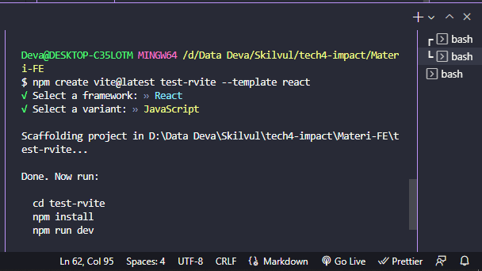

# **Writing Test - Week 6**

## React Js Dasar

### React Js

- React Js adalah sebuah framework view library javascript yang dapat digunakan untuk membantu pembuatan website disisi frontend, React Js dibuat dan dikembangkan oleh Facebook.

### Kenapa Menggunakan React Js?

- React Js is FAST
  
    React Js membuat aplikasi front-end menjadi lebih cepat walaupun harus menghandle berbagai data.

- React Js is MODULAR

    Kita dapat menerapkan konsep Modular javascript pada React Js. React Js membagi tampilan pada website menjadi komponen-komponen kecil.

- React Js is Scalable

    React Js dapat digunakan pada aplikasi beskala kecil hingga besar dan kompleks.

- React Js is Popular

    Komunitas React Js di seluruh dunia sangat besar. Kebanyakan perusahaan teknologi pun sudah menggunakan React Js.

- React Js is component based

- React Js is also support build mobile app in React Native

### Instalasi React Js

- Install [Node JS](https://nodejs.org/en/)

    Npm secara otomatis terinstall saat kita install node JS

- Membuat library create-react-app
  1. npx
        > npx create-react-app my-app
  2. npm
        > npm init react-app my-app
  3. yarn
        > yarn create react-app my-app

    Tampilan workspace project React Js yang telah diinstall (disini saya menambahkan folder components)

    

- Start project
  1. npm
        > npm start
  2. yarn
        > yarn start

        

- Selain menggunakan library create-react-app, kita bisa menggunakan React Vite. Caranya :
  > npm create vite@latest "nama-folder" --template react

    

    Lalu akan muncul pilihan framework, kita bisa pilih React karena menggunakan React.

    

    Lalu memilih akan menggunakan Javascript atau Typescript. Dan kita menggunakan Javascript.

    Selanjutnya akan muncul perintah berikut :

    

    Tampilan workspace project React Js yang telah diinstall. 

    

    Untuk menjalankan project react tersebut menggunakan perintah `npm run dev`.

    

### JSX

- React memiliki format `.jsx` untuk javascript dan `.tsx` untuk typescript.
- JSX adalah syntax extention untuk Javascript dan dikembangkan untuk digunakan pada React Js.
- JSX Rules, Setiap JSX hanya bisa memiliki 1 parent element.

### Virtual DOM

- Virtual DOM adalah dupliaksi dari real DOM yang sebenarnya.
- Dengan menggunakan Virtual DOM, React JS hanya melakukan render ulang pada komponen yang mengalami perubahan.
- Dengan begitu React Js ini menjadi lebih cepat dalam performance.
  
### class dan className

- Pada JSX attribut class di tag element HTML harus menggunakan className.
  
    

### Curly Braces pada JSX

- Kita bisa menggunakan syntax Javascript di dalam element HTML dengan curly braces.
  
    

    > Element dalam tag `<h1>` akan dianggap sebagai Javascript jika menggunakan curly braces. Dan jika tidak menggunakan curly braces, akan dianggap sebegai content HTML.

### Variable pada JSX

- Gunakan curly braces untuk akses variable pada JSX.

    

### Attribute pada JSX

- Menggunakan curly braces untuk data attribute.

    

### Event pada JSX

- Deklarasi event dengan curly braces

    

### Conditional pada JSX

- Contoh menggunakan `if else if`.

    

### map()

- Contoh menampilkan list data pada JSX.

    

### React Component

- Component adalah salah satu core dari React Js dengan membagi UI dalam satuan-satuan kecil.
- Component dibuat jika component tersebut bersifat reuseable code (bisa digunakan kembali).
- Didalam sebuah react kita dapat membuat sebuah component seperti element HTML dengan menggunakan function.
- React Component memiliki dua jenis yaitu class dan funtional.
- **Class Component** adalah react component yang penulisannya menggunakan syntax ES6 class dan didalam class component kita dapat menggunakan state dan props, class component merupakan versi awal dari react component dan sekarang sudah jarang digunakan.
- **Function Component** adalah react component yang penulisannya menggunakan format function, pada awalnya kita hanya dapat menggunakan props didalam functional component akan tetapi setelah adanya hooks kita dapat menggunakan props dan state, functional component merupakan react component yang paling dianjurkan untuk digunakan sekarang ini.


### Membuat Component

Ada 2 cara membuat component:

1. Menggunakan Function   
    ```h
    const StudentInfo = () => {
    return (
        <>
            <h2>Contoh Function</h2>
        </>
        )
    }

    export default StudentInfo;
    ```

2. Menggunakan Class
    ```h
    class Welcome extends React.Component{
        render() {
        return <h1>Hello, {this.props.name}</h1>;
        }

    }
    ```

Untuk menggunakan function yang telah dibuat bisa dengan cara:
```h
import React from 'react';
import StudentInfo from './components/StudentInfo';

function App() {

  return (
    <>
        <StudentInfo />
    </>
  )
}
```

> note: nama component harus diawali huruf kapital

### State & Props

- State & Props adalah hal yang berhubungan dengan Stateless dan Stateful Component.
- Stateless berarti tidak memiliki State. Dia hanya memiliki props.
- Stateful berarti memiliki state dan bisa mengirim state tersebut ke component.

Mengubah StudentInfo menjadi stateless component dan memeiliki 2 props.
```h
const StudentInfo = ({name, age}) => {
    return (
        <>
            <h2>{name}</h2>
            <h2>{age}</h2>
        </>
    )
}

export default StudentInfo;
```

Menambahkan state/local data yang dibutuhkan untuk dikirim ke component StudentInfo.
```h
import React from 'react';
import StudentInfo from './components/StudentInfo';

function App() {

  return (
    <>
      <StudentInfo name={"deva"} age={22} />
    </>
  )
}

export default App;
```

- Jadi, state adalah data lokal. Props digunakan agar component memiliki data yang dinamis yang dikirim dari component lain.

### Event Handler dan Conditional Rendering

- Event yang akan digunakan adalah `onClick()`
    ```h
    // File App.jsx
    import React, { useState } from "react";
    import Counter from "./components/Counter";
    import ListUser from "./components/ListUser";

    function App() {
    const [isLogin, setIsLogin] = useState(false)
    return (
        <div>
        {/* munculin button klo belum login */}
        {!isLogin && <button onClick={() => setIsLogin(true)}>Login</button>}
        
        <br />

        {/* jika sudah login, munculkan counter */}
        {isLogin ? <Counter /> : <span>Login dahulu!</span>}

        {isLogin && <ListUser />}

        {/* <Counter /> */}

        {/* Props */}
        {/* <Card nama="Alpha" umur="17" />
        <Card nama="Bravo" umur="18" />
        <Card nama="Charlie" umur="19" /> */}

        {/* <ListUser /> */}

        </div>
    )
    }

    export default App;
    ```

    ```h
    // File ListUser.jsx
    import React, { useState } from "react";
    import Card from "./Card";

    function ListUser() {
        const [users, setUsers] = useState([
            {name: "Alpha", umur: 17},
            {name: "Beta", umur: 18},
            {name: "Charlie", umur: 19},
            {name: "Delta", umur: 20},
        ])

        return(
            <div>
                {/* Before */}
                {/* <Card nama="Alpha" umur="17" />
                <Card nama="Bravo" umur="18" />
                <Card nama="Charlie" umur="19" /> */}

                {/* After(alternatif) */}
                {/* Solusi Loop data array lalu di tampilkan */}
                {users.map((item, index) => (
                    <Card key={index} nama={item.name} umur={item.umur} />
                ))}
            </div>
        )    
    }

    export default ListUser;
    ```

    ```h
    // File Counter.jsx
    import { useState } from "react";

    function Counter() {
        const [count, setCount] = useState(0)   // benar
        // let count = 0                        // salah

        const increment = () => {
            console.log("increment");
            
            setCount(count + 1)     // benar
            // count = count + 1    // salah
        }

        // const decrement = () => {
        //     console.log("decrement");

        //     setCount(count - 1)
        // }

        return(
            <>
                {/* Counter diberi event click */}
                <button onClick={() => setCount(count - 1)}>-</button>
                <span> {count} </span>
                <button onClick={increment}>+</button>
            </>
        )
    }

    export default Counter;
    ```

## React Js Lanjutan

### React Lifecycle

- Lifecycle didalam react memiliki tiga alur utama

- **Mounting** adalah sebuah siklus pertama ketika aplikasi dibuka.
- **Update** adalah sebuah siklus ketika terjadi perubahan data.
- **Unmount** adalah siklus setelah komponen dibuka.

- Sebelum versi 16 atau adanya Hooks untuk memanipulasi Lifesycle didalam React harus menggunakan
  - componentDidMount();
  - componentWillUpdate();
  - componentWillUnMount();
- Sedangkan untuk versi 16 setelah Hooks sampai sekarang kita dapat menggunakan useEffect() untuk menghandle Lifecycle didalam React.

### Form

- Pada react form ini kita akan banyak menggunakan event handler. Seperti `onChange()` & `onSubmit()`.
- `onChange()`, digunakan untuk mengambil data/perubahan dari inputan. Sedangkan `onSubmit()`, digunakan untuk mengsubmit data pada form agar bisa diolah.
- Selain itu kita bisa menambahkan data ke API dengan menggunakan `axios`.

Contoh code untuk form dan menambahkan data ke dalam API:
```h
// File Form.jsx
import { useState } from "react";
import axios from "axios";

const Form = () => {
    const [name, setName] = useState("")
    const [address, setAddress] = useState("")
    const [programs, setPrograms] = useState("")
    const [data, setData] =  useState({})

    // console.log(name, address);

    const handleSubmit = (e) => {
        e.preventDefault();
        
        // input data kedalam API
        axios.post("https://63478ac3db76843976ad4d42.mockapi.io/student", {
            name,
            address,
            programs,
        })
        .then(() => {
            setData({ name, address, programs });
            setName("");
            setAddress("");
            setPrograms("");
        })
        .catch((err) => {
            console.log(err);
        })

        // alert(`Nama: ${name}, Address: ${address}`);
        // setData({ name, address, programs });
        // setName("");
        // setAddress("");
        // setPrograms("");
    }

    console.log(data);

    return (
        <>
            <form action="" onSubmit={handleSubmit}>
                <label htmlFor="nama">Name </label>
                <input type="text" value={name} onChange={(e) => setName(e.target.value)} /><br />
                <label htmlFor="address">Address </label>
                <input type="text" value={address} onChange={(e) => setAddress(e.target.value)} /><br />
                <label htmlFor="option">Programs </label>
                <select value={programs} onChange={(e) => setPrograms(e.target.value)} >
                    <option value="">Select Program</option>
                    <option value="KM">KM</option>
                    <option value="SIC">SIC</option>
                    <option value="Amman">Amman</option>
                </select><br />
                <button type="submit">Submit</button>
            </form>
            <br />
            <h2>Name: {data.name}</h2>
            <h2>Address: {data.address}</h2>
            <h2>Program: {data.programs}</h2>
        </>
    )
}

export default Form;
```

```h
// File App.jsx
import React from 'react'
import Form from './components/Form';

function App() {

  return (
    <div className="App">
      <Form />
    </div>
  )
}

export default App;
```

### Hooks

- Hooks merupakan fitur baru di React 16.8. Fitur ini memungkinkan Anda menggunakan state dan fitur React lainnya tanpa menuliskan sebuah kelas. Hooks menggunakan konsep Functional Component.
- Hooks adalah fungsi spesial yang memungkinkan Anda “terhubung” dengan fitur-fitur di React. Sebagai contoh, useState adalah sebuah Hook yang memungkinkan Anda memberi state pada function components. 
- Ada beberapa Hooks yang disediakan oleh react, berikut hooks yang paling populer dan sering digunakan
  - **useState()** adalah hook yang digunakan untuk membuat dan memanipulasi sebuah state.
  - **useEffect()** adalah hook yang digunakan untuk menghandle lifecycle.
  - **useRef()** adalah hook untuk memanipulasi elemen DOM.
  - **useContext** adalah hook untuk memanipulasi sebuah Context API.
  - dll

Contoh penggunaan hooks:
```h
import React, { useState } from 'react';

function Example() {
// Deklarasi variabel state baru yang kita sebut "count"
const [count, setCount] = useState(0);

return (
    <>
        <p>Anda menekan sebanyak {count} kali</p>
        <button onClick={() => setCount(count + 1)}>
            Klik saya
        </button>
    </>
);
}
```