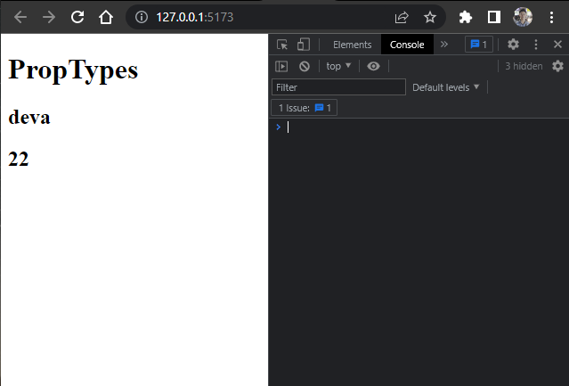
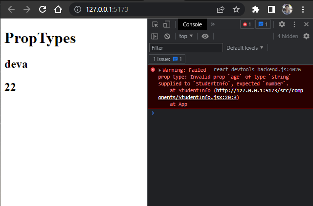
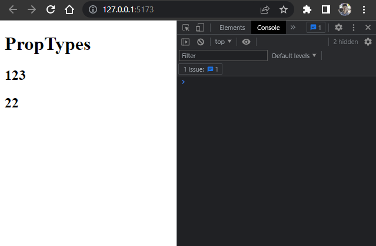
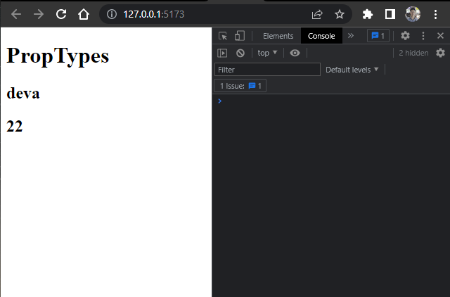
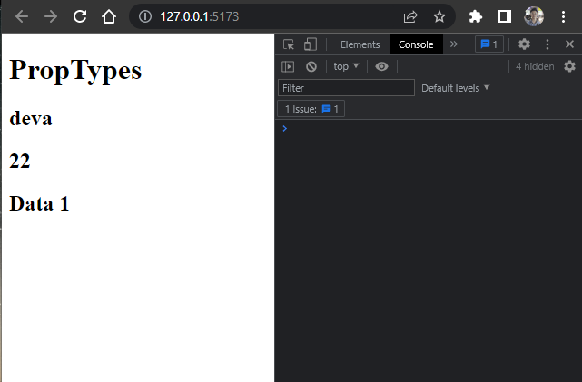
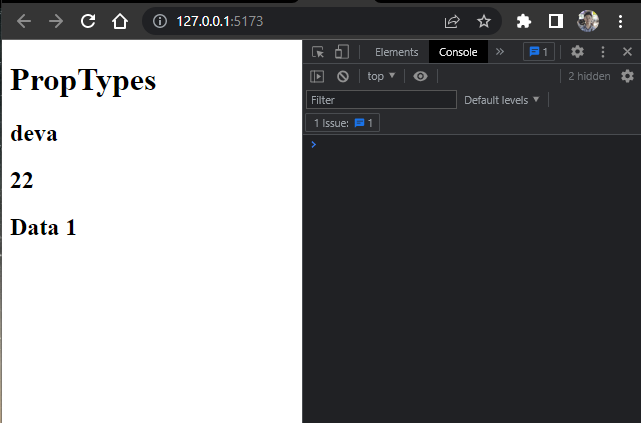
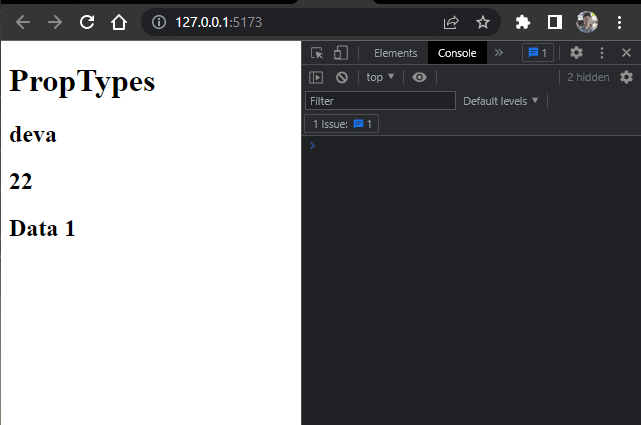
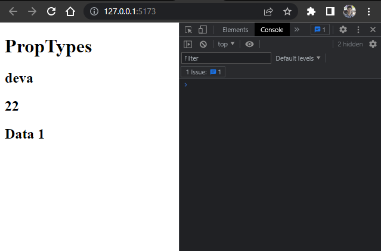
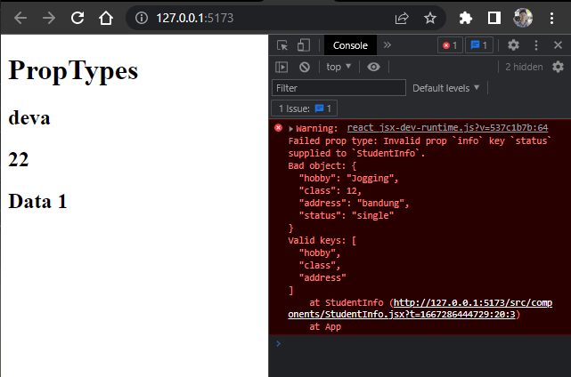

# **Writing Test - Week 7**

## React Js Lanjutan

### PropTypes

- Prop Types merupakan sebuah lib yang dapat membantu kita untuk memeriksa data props yang kita kirim agar sesuai dengan ekspektasi. Jika tidak sesuai, maka akan muncul pesan error.

### Install PropTypes

- Cara install nya cukup dengan menjalankan perintah berikut:
  
    ```h
    npm install prop-types 
    ```

### Penggunaan Props Types

- Menggunakan tipe data `string` dan `number`

    ```h
    // File App.jsx
    import React from 'react';
    import StudentInfo from './components/StudentInfo';

    function App() {

        return (
            <>
                <h1>PropTypes</h1>
                <StudentInfo name={"deva"} age={22} />
            </>
        )
    }

    export default App;
    ```

    ```h
    // File StudentInfi.jsx
    import PropTypes from "prop-types";

    const StudentInfo = ({name, age}) => {
        return (
            <>
                <h2>{name}</h2>
                <h2>{age}</h2>
            </>
        )
    }

    StudentInfo.propTypes = {
        // type data string
        name: PropTypes.string,
        // type data number
        age: PropTypes.number,
    };

    export default StudentInfo;
    ```

    

    Props yang akan dikirim harus sesuai dengan tipe data yang diharapkan. Jika tidak, maka akan muncul pesan error.

    

- Menggunakan type data `any` dan `isRequered`

    Dengan menggunakan tipe data `any`, kita memasukkan data props dengan tipe data apapun. Sedangkan `isRequired` maksudnya kita harus mengisi props dengan data dan tidak boleh kosong.

    Contoh type data `any`:

    ```h
    //File App.jsx
    <StudentInfo name={123} age={22} />
    ```

    ```h
    // File StudentInfo.jsx
    // Menggunakan tipe data any dan isRequired pada props name
    name: PropTypes.any.isRequired,
    age: PropTypes.number,
    ```

    

    Jika kita tidak mengisi atau mengirimkan data pada props `name`, maka akan error.

     ```h
    //File App.jsx
    <StudentInfo age={22} />
    ```

    

- Menggunakan type data `oneOfType`

    Maksudnya kita bisa memberikan opsi untuk type data yang bisa digunakan lebih dari satu. Dan apabila tipe data yang dikirim diluar dari type data yang sudah ditentukan, maka akan mendapat pesan error.

    Contoh type data `onOfType`:

    ```h
    // File App.jsx
    <StudentInfo name={"deva"} age={"22"}
    ```

    ```h
    // File StudentInfo.jsx
    name: PropTypes.string,
    age: PropTypes.oneOfType([PropTypes.string, PropTypes.number]),
    ```

    Kita memberikan opsi tipe data yang bisa dikirim pada props age, yaitu `string` & `number`.

    

    Jika memberikan tipe data selain yang sudah ditentukan, maka akan mendapat pesan error.

    ```h
    // File App.jsx
    <StudentInfo name={"deva"} age={[22]}
    ```

    

- Menggunakan type data `array`

    ```h
    // File App.jsx
    <StudentInfo name={"deva"} age={22} data={["Data ", 1]} />
    ```

    ```h
    // File StudentInfo.jsx
    name: PropTypes.string,
    age: PropTypes.number,
    data: PropTypes.array, // tipe data array
    ```

    

- Menggunakan type data `arrayOf`

    Digunakan untuk mengecek value dari props array.

    ```h
    // File App.jsx
    <StudentInfo name={"deva"} age={22} data={["Data ", 1]}
    ```

    ```h
    // File StudentInfo.jsx
    name: PropTypes.string,
    age: PropTypes.number,
    data: PropTypes.arrayOf(PropTypes.number),
    ```

    Type data yang diinginkan adalah `number`, jika selain itu maka akan mendapat pesan error.

    

- Menggunakan type data `arrayOf` & `oneOfType`

    Kita bisa mengkombinasikan `arrayOf` & `oneOfType` dengan cara berikut

    ```h
    // File App.jsx
    <StudentInfo name={"deva"} age={22} data={["Data ", 1]}
    ```

    ```h
    // File StudentInfo.jsx
    name: PropTypes.string,
    age: PropTypes.number,
    data: PropTypes.arrayOf(PropTypes.oneOfType([PropTypes.string, PropTypes.number])),
    ```

    Sehingga, type data yang bisa dikirim pada array bisa dengan `string` atau `number`.

    

- Menggunakan type data `object`

    ```h
    // File App.jsx
    <StudentInfo name={"deva"} age={22} data={["Data ", 1]} info={{hobby: "Jogging", class: 12, address: "bandung" }} />
    ```

    ```h
    // File StudentInfo.jsx
    info: PropTypes.object,
    ```

- Menggunakan type data `shape`

    Digunakan untuk mengetahui dan mensetting value dari `object`

    ```h
    // File App.jsx
    <StudentInfo name={"deva"} age={22} data={["Data ", 1]} info={{hobby: "Jogging", class: 12, address: "bandung" }} />
    ```

    ```h
    // File StudentInfo.jsx
    info: PropTypes.shape({
        hobby: PropTypes.string,
        class: PropTypes.number,
        address: PropTypes.string,
    })
    ```

    

    Jika type data yang dikirim berbeda, maka akan mendapat pesan error.

     ```h
    // File App.jsx
    <StudentInfo name={"deva"} age={22} data={["Data ", 1]} info={{hobby: "Jogging", class: "12", address: "bandung" }} />
    ```

    

- Menggunakan type data `exact`

    Digunakan untuk mengecek value dari object dan key tidak boleh lebih dari yang ditentukan.

     ```h
    // File App.jsx
    <StudentInfo name={"deva"} age={22} data={["Data ", 1]} info={{hobby: "Jogging", class: 12, address: "bandung" }} />
    ```

    ```h
    // File StudentInfo.jsx
    info: PropTypes.exact({
        hobby: PropTypes.string,
        class: PropTypes.number,
        address: PropTypes.string,
    })
    ```

    

    Jika key pada object lebih dari yang ditentukan, maka akan mendapat pesan error.

    ```h
    // FIle App.jsx
    <StudentInfo name={"deva"} age={22} data={["Data ", 1]} info={{hobby: "Jogging", class: 12, address: "bandung", status: "single" }} />
    ```

    