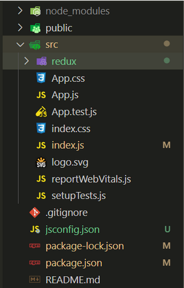
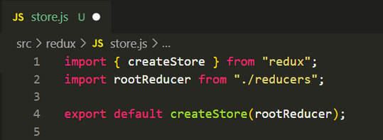
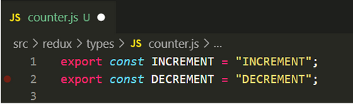
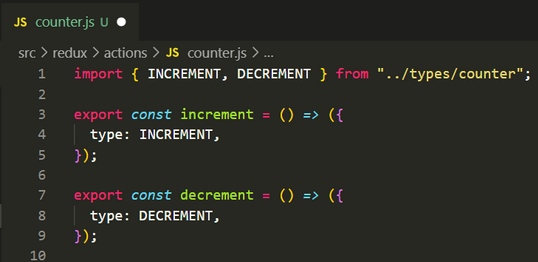
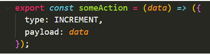
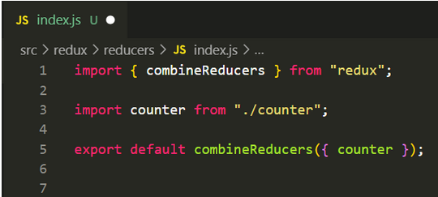

# **Writing Test - Week 7**

## React Js Lanjutan

### PropTypes

- Prop Types merupakan sebuah lib yang dapat membantu kita untuk memeriksa data props yang kita kirim agar sesuai dengan ekspektasi. Jika tidak sesuai, maka akan muncul pesan error.

### Install PropTypes

- Cara install nya cukup dengan menjalankan perintah berikut:
  
    ```h
    npm install prop-types 
    ```

### Penggunaan Props Types

- Menggunakan tipe data `string` dan `number`

    ```h
    // File App.jsx
    import React from 'react';
    import StudentInfo from './components/StudentInfo';

    function App() {

        return (
            <>
                <h1>PropTypes</h1>
                <StudentInfo name={"deva"} age={22} />
            </>
        )
    }

    export default App;
    ```

    ```h
    // File StudentInfi.jsx
    import PropTypes from "prop-types";

    const StudentInfo = ({name, age}) => {
        return (
            <>
                <h2>{name}</h2>
                <h2>{age}</h2>
            </>
        )
    }

    StudentInfo.propTypes = {
        // type data string
        name: PropTypes.string,
        // type data number
        age: PropTypes.number,
    };

    export default StudentInfo;
    ```

    

    Props yang akan dikirim harus sesuai dengan tipe data yang diharapkan. Jika tidak, maka akan muncul pesan error.

    

- Menggunakan type data `any` dan `isRequered`

    Dengan menggunakan tipe data `any`, kita memasukkan data props dengan tipe data apapun. Sedangkan `isRequired` maksudnya kita harus mengisi props dengan data dan tidak boleh kosong.

    Contoh type data `any`:

    ```h
    //File App.jsx
    <StudentInfo name={123} age={22} />
    ```

    ```h
    // File StudentInfo.jsx
    // Menggunakan tipe data any dan isRequired pada props name
    name: PropTypes.any.isRequired,
    age: PropTypes.number,
    ```

    

    Jika kita tidak mengisi atau mengirimkan data pada props `name`, maka akan error.

     ```h
    //File App.jsx
    <StudentInfo age={22} />
    ```

    

- Menggunakan type data `oneOfType`

    Maksudnya kita bisa memberikan opsi untuk type data yang bisa digunakan lebih dari satu. Dan apabila tipe data yang dikirim diluar dari type data yang sudah ditentukan, maka akan mendapat pesan error.

    Contoh type data `onOfType`:

    ```h
    // File App.jsx
    <StudentInfo name={"deva"} age={"22"}
    ```

    ```h
    // File StudentInfo.jsx
    name: PropTypes.string,
    age: PropTypes.oneOfType([PropTypes.string, PropTypes.number]),
    ```

    Kita memberikan opsi tipe data yang bisa dikirim pada props age, yaitu `string` & `number`.

    

    Jika memberikan tipe data selain yang sudah ditentukan, maka akan mendapat pesan error.

    ```h
    // File App.jsx
    <StudentInfo name={"deva"} age={[22]}
    ```

    

- Menggunakan type data `array`

    ```h
    // File App.jsx
    <StudentInfo name={"deva"} age={22} data={["Data ", 1]} />
    ```

    ```h
    // File StudentInfo.jsx
    name: PropTypes.string,
    age: PropTypes.number,
    data: PropTypes.array, // tipe data array
    ```

    

- Menggunakan type data `arrayOf`

    Digunakan untuk mengecek value dari props array.

    ```h
    // File App.jsx
    <StudentInfo name={"deva"} age={22} data={["Data ", 1]}
    ```

    ```h
    // File StudentInfo.jsx
    name: PropTypes.string,
    age: PropTypes.number,
    data: PropTypes.arrayOf(PropTypes.number),
    ```

    Type data yang diinginkan adalah `number`, jika selain itu maka akan mendapat pesan error.

    

- Menggunakan type data `arrayOf` & `oneOfType`

    Kita bisa mengkombinasikan `arrayOf` & `oneOfType` dengan cara berikut

    ```h
    // File App.jsx
    <StudentInfo name={"deva"} age={22} data={["Data ", 1]}
    ```

    ```h
    // File StudentInfo.jsx
    name: PropTypes.string,
    age: PropTypes.number,
    data: PropTypes.arrayOf(PropTypes.oneOfType([PropTypes.string, PropTypes.number])),
    ```

    Sehingga, type data yang bisa dikirim pada array bisa dengan `string` atau `number`.

    

- Menggunakan type data `object`

    ```h
    // File App.jsx
    <StudentInfo name={"deva"} age={22} data={["Data ", 1]} info={{hobby: "Jogging", class: 12, address: "bandung" }} />
    ```

    ```h
    // File StudentInfo.jsx
    info: PropTypes.object,
    ```

- Menggunakan type data `shape`

    Digunakan untuk mengetahui dan mensetting value dari `object`

    ```h
    // File App.jsx
    <StudentInfo name={"deva"} age={22} data={["Data ", 1]} info={{hobby: "Jogging", class: 12, address: "bandung" }} />
    ```

    ```h
    // File StudentInfo.jsx
    info: PropTypes.shape({
        hobby: PropTypes.string,
        class: PropTypes.number,
        address: PropTypes.string,
    })
    ```

    

    Jika type data yang dikirim berbeda, maka akan mendapat pesan error.

     ```h
    // File App.jsx
    <StudentInfo name={"deva"} age={22} data={["Data ", 1]} info={{hobby: "Jogging", class: "12", address: "bandung" }} />
    ```

    

- Menggunakan type data `exact`

    Digunakan untuk mengecek value dari object dan key tidak boleh lebih dari yang ditentukan.

     ```h
    // File App.jsx
    <StudentInfo name={"deva"} age={22} data={["Data ", 1]} info={{hobby: "Jogging", class: 12, address: "bandung" }} />
    ```

    ```h
    // File StudentInfo.jsx
    info: PropTypes.exact({
        hobby: PropTypes.string,
        class: PropTypes.number,
        address: PropTypes.string,
    })
    ```

    

    Jika key pada object lebih dari yang ditentukan, maka akan mendapat pesan error.

    ```h
    // FIle App.jsx
    <StudentInfo name={"deva"} age={22} data={["Data ", 1]} info={{hobby: "Jogging", class: 12, address: "bandung", status: "single" }} />
    ```

    

## React Router

- React Router merupakan standar library untuk routing pada React.
- Standar routing berfungsi untuk membuat suatu website menjadi dynamic.
- Pada React, Router membantu untuk mengarahka page satu ke page yg lainnya berdasarkan path url yg ditentukan.
- Instalasi React Router
  React berisi tiga paket berbeda untuk perutean:
    1. react-router: Ini menyediakan komponen dan fungsi perutean inti untuk aplikasi React Router.
    2. react-router-native: Ini digunakan untuk aplikasi seluler.
    3. react-router-dom: Digunakan untuk desain aplikasi web.

        ```h
        npm install react-router-dom -save
        ```

- Ada dua jenis komponen router:
    1. ```<BrowserRouter>```: Ini digunakan untuk menangani URL dinamis.
    2. ```<HashRouter>```: Ini digunakan untuk menangani permintaan statis.

        ```h
        <BrowserRouter>
            <App />
        </BrowserRouter>
        ```

- Browser Router merupakan interface pada umumnya yg digunakan  untuk menjalankan react di browser atau untuk membuat router-router sederhana.
- HashRouter penulisannya menggunakan #, yg digunakan pada sebuah website yang menggunakan satu page saja.
- 3 cara penggunaan router :
  - Routing Dasar
  - Dynamic Route
  - Nested Route
  
- Configuring The Router

    ```h
    import React from "react"
    import ReactDOM from "react-dom/client"
    import App from "./App"
    import { BrowserRouter } from "react-router-dom"

    const root = ReactDOM.createRoot(document.getElementById("root"))
    root.render(
    <React.StrictMode>
        <BrowserRouter>
        <App />
        </BrowserRouter>
    </React.StrictMode>
    )
    ```

- Defining Routes

    ```h
    import { Route, Routes } from "react-router-dom"
    import { Home } from "./Home"
    import { BookList } from "./BookList"

    export function App() {
        return (
            <Routes>
            <Route path="/" element={<Home />} />
            <Route path="/books" element={<BookList />} />
            </Routes>
        )
    }
    ```

- Handling Navigation

    ```h
    import { Route, Routes, Link } from "react-router-dom"
    import { Home } from "./Home"
    import { BookList } from "./BookList"

    export function App() {
    return (
        <>
        <nav>
            <ul>
            <li><Link to="/">Home</Link></li>
            <li><Link to="/books">Books</Link></li>
            </ul>
        </nav>

        <Routes>
            <Route path="/" element={<Home />} />
            <Route path="/books" element={<BookList />} />
        </Routes>
        </>
    )
    }
    ```

- Routing Priority

    ```h
    <Routes>
        <Route path="/" element={<Home />} />
        <Route path="/books" element={<BookList />} />
        <Route path="/books/:id" element={<Book />} />
        <Route path="/books/new" element={<NewBook />} />
        <Route path="*" element={<NotFound />} />
    </Routes>
    ```

- Nested Routes

    ```h
    <Routes>
        <Route path="/" element={<Home />} />
            <Route path="/books">
                <Route index element={<BookList />} />
                <Route path=":id" element={<Book />} />
                <Route path="new" element={<NewBook />} />
            </Route>
        <Route path="*" element={<NotFound />} />
    </Routes>
    ```

- Shared Layout

    ```h
    <Routes>
        <Route path="/" element={<Home />} />
            <Route path="/books" element={<BooksLayout />}>
                <Route index element={<BookList />} />
                <Route path=":id" element={<Book />} />
                <Route path="new" element={<NewBook />} />
            </Route>
        <Route path="*" element={<NotFound />} />
    </Routes>
    ```

## React Redux

- Redux digunakan untuk mengolah state management
- Yaitu dengan menyimpan state di satu tempat, sehingga lebih mudah untuk di manage.
- Cara kerja Redux :
  - Action : Adalah sebuah function yang mereturn sebuah objek.
  - Reducer : sebuah fungsi yang tugasnya untuk mengolah state yang ada di store.
  - Store : tempat untuk menampung state
- Setup Redux

    ```h
    npm install redux react-redux
    ```

- Setelah install, siapkan folder redux di dalam src.

    

- File Store

  Buat file store.js pada folder redux [/src/redux/store.js] dan sematkan kode berikut:

  

- Types

  Ada yang menyebut sebagai constants atau types dimana kita mendeklarasi setiap kegiatan yang akan terjadi pada reducer counter agar tidak ada salah sebut nama variable ketika digunakan. Maka sebaiknya kita buat 1 folder types pada redux [/src/redux/types] dan sebuah file baru dengan nama counter.js dengan kode berikut:

  

- Actions

  Pada folder ini kita harus setuju bahwa semua action atau kegiatan atau juga bisa disebut kejadian akan kita letakkan pada folder ini.
  
  Buat folder baru actions di dalam folder redux [/src/redux/actions/] dan buat sebuah file dengan nama counter.js
  
  
  - Pada baris pertama kita import semua kegiatan yang kita miliki pada tipe kegiatan yang akan terjadi pada reducer counter
  - Pada baris 3-5 adalah sebuah arrow function dengan nama increment yang hanya mengirim sebuah object (dispatch) ke reducer kita dengan isian object seperti tertera pada line 4.

  Jika action kita cukup kompleks dan memiliki data yang akan dikirim, kita bisa sematkan sebagai kode snippet berikut:

  

  - Pada baris 7-9 sama dengan baris function sebelumnya hanya beda kegiatan.

- Reducer

  Pada folder ini dimana semua states kita tinggal, kita perlu membuat folder reducer [/src/redux/reducers/] dan file pertama yaitu index.js yang akan kita gunakan untuk indexing setiap reducer kita dan menggabungkan semua state yang kita miliki.

  

  - Line pertama kita import combineReducers sebuah function dari package redux untuk menggabungkan object-object state yang kita miliki.
  - Line 3 kita import counter dari file counter.js
  - Line 5 kita export secara default object yang sudah digabung menggunakan combineReducers.

## Redux Thunk

- Redux Thunk adalah middleware yang memungkinkan Anda memanggil pembuat aksi yang mengembalikan fungsi sebagai ganti objek aksi.
- Fungsi itu menerima metode pengiriman penyimpanan, yang kemudian digunakan untuk mengirim aksi sinkron di dalam isi fungsi setelah operasi asinkron selesai.
- Installasi redux-thunk

    ```h
    npm install redux-thunk
    ```

- Contoh penerapan

    ```h
    import React from 'react';
    import ReactDOM from 'react-dom';
    import { Provider } from 'react-redux';
    import { createStore, applyMiddleware } from 'redux';
    import thunk from 'redux-thunk';
    import './index.css';
    import rootReducer from './reducers';
    import App from './App';
    import * as serviceWorker from './serviceWorker';

    // use applyMiddleware to add the thunk middleware to the store
    const store = createStore(rootReducer, applyMiddleware(thunk));

    ReactDOM.render(
    <Provider store={store}>
        <App />
    </Provider>,
    document.getElementById('root')
    );
    ```
